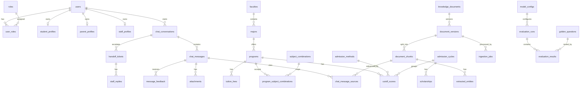

# 03. Thiết kế Database SQL Server

## 1. Nguyên tắc thiết kế

- SQL Server lưu dữ liệu quan hệ và nghiệp vụ chính.
- Qdrant lưu embedding vector cho RAG.
- SQL Server lưu metadata của chunk và `qdrant_point_id` để liên kết với Qdrant.
- Dùng soft delete cho dữ liệu nghiệp vụ quan trọng bằng `status` hoặc `is_deleted`.
- Mọi bảng quan trọng có `created_at`, `updated_at`.
- Mọi thao tác admin quan trọng ghi vào `audit_logs`.
- Điểm chuẩn/học phí phải gắn với năm hoặc kỳ tuyển sinh để tránh sai lệch dữ liệu theo thời gian.

## 2. Quy ước chung

| Quy ước | Giá trị |
|---|---|
| Primary key | `uniqueidentifier` |
| Ngày giờ | `datetime2` |
| Text ngắn | `nvarchar(255)` |
| Text dài | `nvarchar(max)` |
| Trạng thái | `nvarchar(50)` hoặc enum trong code |
| Tiền tệ | `decimal(18,2)` |
| Điểm | `decimal(5,2)` |
| Boolean | `bit` |

## 3. Nhóm Identity và phân quyền

### 3.1. `users`

| Cột | Kiểu | Ràng buộc | Ghi chú |
|---|---|---|---|
| `id` | uniqueidentifier | PK | User id |
| `email` | nvarchar(255) | unique, not null | Email đăng nhập |
| `password_hash` | nvarchar(max) | not null | Hash mật khẩu |
| `full_name` | nvarchar(255) | not null | Họ tên |
| `phone` | nvarchar(30) | null | SĐT |
| `avatar_url` | nvarchar(500) | null | Ảnh đại diện |
| `status` | nvarchar(50) | not null | active, locked, pending |
| `email_verified_at` | datetime2 | null | Xác thực email nếu có |
| `last_login_at` | datetime2 | null | Lần đăng nhập gần nhất |
| `created_at` | datetime2 | not null |  |
| `updated_at` | datetime2 | not null |  |

Index:

- Unique index `IX_users_email`.
- Index `IX_users_status`.

### 3.2. `roles`

| Cột | Kiểu | Ràng buộc | Ghi chú |
|---|---|---|---|
| `id` | uniqueidentifier | PK |  |
| `code` | nvarchar(50) | unique, not null | student, parent, staff, admin |
| `name` | nvarchar(100) | not null | Tên hiển thị |
| `description` | nvarchar(500) | null |  |

### 3.3. `user_roles`

| Cột | Kiểu | Ràng buộc | Ghi chú |
|---|---|---|---|
| `user_id` | uniqueidentifier | PK, FK users |  |
| `role_id` | uniqueidentifier | PK, FK roles |  |
| `assigned_at` | datetime2 | not null |  |
| `assigned_by` | uniqueidentifier | FK users, null | Admin gán |

### 3.4. `student_profiles`

| Cột | Kiểu | Ràng buộc | Ghi chú |
|---|---|---|---|
| `user_id` | uniqueidentifier | PK, FK users |  |
| `high_school` | nvarchar(255) | null | Trường THPT |
| `province` | nvarchar(100) | null | Tỉnh/thành |
| `graduation_year` | int | null | Năm tốt nghiệp |
| `expected_score` | decimal(5,2) | null | Điểm dự kiến |
| `exam_score` | decimal(5,2) | null | Điểm thực tế |
| `interested_subject_group` | nvarchar(50) | null | A00, A01... |
| `notes` | nvarchar(max) | null | Ghi chú tư vấn |
| `created_at` | datetime2 | not null |  |
| `updated_at` | datetime2 | not null |  |

### 3.5. `parent_profiles`

| Cột | Kiểu | Ràng buộc | Ghi chú |
|---|---|---|---|
| `user_id` | uniqueidentifier | PK, FK users |  |
| `occupation` | nvarchar(255) | null | Nghề nghiệp |
| `province` | nvarchar(100) | null | Tỉnh/thành |
| `contact_preference` | nvarchar(50) | null | email, phone, chat |
| `created_at` | datetime2 | not null |  |
| `updated_at` | datetime2 | not null |  |

### 3.6. `parent_student_links`

| Cột | Kiểu | Ràng buộc | Ghi chú |
|---|---|---|---|
| `id` | uniqueidentifier | PK |  |
| `parent_user_id` | uniqueidentifier | FK users | Phụ huynh |
| `student_user_id` | uniqueidentifier | FK users | Học sinh |
| `relationship` | nvarchar(50) | null | father, mother, guardian |
| `status` | nvarchar(50) | not null | pending, active, revoked |
| `created_at` | datetime2 | not null |  |

### 3.7. `staff_profiles`

| Cột | Kiểu | Ràng buộc | Ghi chú |
|---|---|---|---|
| `user_id` | uniqueidentifier | PK, FK users |  |
| `department` | nvarchar(255) | null | Phòng ban |
| `position` | nvarchar(255) | null | Chức vụ |
| `can_manage_documents` | bit | not null | Quyền upload tài liệu |
| `can_reply_chat` | bit | not null | Quyền phản hồi |
| `created_at` | datetime2 | not null |  |
| `updated_at` | datetime2 | not null |  |

### 3.8. `refresh_tokens`

| Cột | Kiểu | Ràng buộc | Ghi chú |
|---|---|---|---|
| `id` | uniqueidentifier | PK |  |
| `user_id` | uniqueidentifier | FK users |  |
| `token_hash` | nvarchar(max) | not null | Không lưu token thô |
| `expires_at` | datetime2 | not null |  |
| `revoked_at` | datetime2 | null |  |
| `created_at` | datetime2 | not null |  |
| `created_by_ip` | nvarchar(50) | null |  |

## 4. Nhóm dữ liệu tuyển sinh

### 4.1. `admission_cycles`

| Cột | Kiểu | Ràng buộc | Ghi chú |
|---|---|---|---|
| `id` | uniqueidentifier | PK |  |
| `year` | int | unique, not null | 2024, 2025, 2026 |
| `name` | nvarchar(255) | not null | Tuyển sinh 2026 |
| `start_date` | date | null |  |
| `end_date` | date | null |  |
| `status` | nvarchar(50) | not null | draft, active, archived |

### 4.2. `faculties`

| Cột | Kiểu | Ràng buộc | Ghi chú |
|---|---|---|---|
| `id` | uniqueidentifier | PK |  |
| `code` | nvarchar(50) | unique, not null |  |
| `name` | nvarchar(255) | not null |  |
| `description` | nvarchar(max) | null |  |
| `status` | nvarchar(50) | not null | active, inactive |
| `created_at` | datetime2 | not null |  |
| `updated_at` | datetime2 | not null |  |

### 4.3. `majors`

| Cột | Kiểu | Ràng buộc | Ghi chú |
|---|---|---|---|
| `id` | uniqueidentifier | PK |  |
| `faculty_id` | uniqueidentifier | FK faculties |  |
| `code` | nvarchar(50) | unique, not null | Mã ngành |
| `name` | nvarchar(255) | not null | Tên ngành |
| `description` | nvarchar(max) | null |  |
| `career_outcomes` | nvarchar(max) | null | Cơ hội nghề nghiệp |
| `status` | nvarchar(50) | not null | active, inactive |
| `created_at` | datetime2 | not null |  |
| `updated_at` | datetime2 | not null |  |

Index:

- `IX_majors_faculty_id`.
- Full-text index gợi ý trên `name`, `description`, `career_outcomes`.

### 4.4. `programs`

| Cột | Kiểu | Ràng buộc | Ghi chú |
|---|---|---|---|
| `id` | uniqueidentifier | PK |  |
| `major_id` | uniqueidentifier | FK majors |  |
| `code` | nvarchar(50) | unique, not null | Mã chương trình |
| `name` | nvarchar(255) | not null | Tên chương trình |
| `degree_type` | nvarchar(100) | null | Đại học chính quy... |
| `language` | nvarchar(100) | null | Vietnamese, English |
| `campus` | nvarchar(255) | null | Cơ sở học |
| `duration_years` | decimal(3,1) | null | 3.5, 4 |
| `description` | nvarchar(max) | null |  |
| `status` | nvarchar(50) | not null | active, inactive |
| `created_at` | datetime2 | not null |  |
| `updated_at` | datetime2 | not null |  |

### 4.5. `subject_combinations`

| Cột | Kiểu | Ràng buộc | Ghi chú |
|---|---|---|---|
| `id` | uniqueidentifier | PK |  |
| `code` | nvarchar(20) | unique, not null | A00, A01, D01 |
| `subjects` | nvarchar(255) | not null | Toán, Lý, Hóa |
| `description` | nvarchar(500) | null |  |

### 4.6. `program_subject_combinations`

| Cột | Kiểu | Ràng buộc | Ghi chú |
|---|---|---|---|
| `program_id` | uniqueidentifier | PK, FK programs |  |
| `subject_combination_id` | uniqueidentifier | PK, FK subject_combinations |  |

### 4.7. `admission_methods`

| Cột | Kiểu | Ràng buộc | Ghi chú |
|---|---|---|---|
| `id` | uniqueidentifier | PK |  |
| `code` | nvarchar(50) | unique, not null | THPT, HOC_BA, DGNL |
| `name` | nvarchar(255) | not null |  |
| `description` | nvarchar(max) | null |  |
| `status` | nvarchar(50) | not null | active, inactive |

### 4.8. `cutoff_scores`

| Cột | Kiểu | Ràng buộc | Ghi chú |
|---|---|---|---|
| `id` | uniqueidentifier | PK |  |
| `program_id` | uniqueidentifier | FK programs |  |
| `admission_cycle_id` | uniqueidentifier | FK admission_cycles |  |
| `admission_method_id` | uniqueidentifier | FK admission_methods |  |
| `subject_combination_id` | uniqueidentifier | FK subject_combinations, null | Nếu điểm theo tổ hợp |
| `score` | decimal(5,2) | not null | Điểm chuẩn |
| `note` | nvarchar(max) | null |  |
| `created_at` | datetime2 | not null |  |
| `updated_at` | datetime2 | not null |  |

Index:

- Unique filtered/index theo `program_id`, `admission_cycle_id`, `admission_method_id`, `subject_combination_id`.
- `IX_cutoff_scores_program_cycle`.

### 4.9. `tuition_fees`

| Cột | Kiểu | Ràng buộc | Ghi chú |
|---|---|---|---|
| `id` | uniqueidentifier | PK |  |
| `program_id` | uniqueidentifier | FK programs |  |
| `academic_year` | nvarchar(20) | not null | 2026-2027 |
| `amount_min` | decimal(18,2) | null | Mức thấp |
| `amount_max` | decimal(18,2) | null | Mức cao |
| `currency` | nvarchar(10) | not null | VND |
| `unit` | nvarchar(50) | not null | semester, year, credit |
| `note` | nvarchar(max) | null |  |
| `created_at` | datetime2 | not null |  |
| `updated_at` | datetime2 | not null |  |

### 4.10. `scholarships`

| Cột | Kiểu | Ràng buộc | Ghi chú |
|---|---|---|---|
| `id` | uniqueidentifier | PK |  |
| `admission_cycle_id` | uniqueidentifier | FK admission_cycles |  |
| `title` | nvarchar(255) | not null |  |
| `description` | nvarchar(max) | null |  |
| `condition_text` | nvarchar(max) | null | Điều kiện |
| `value_text` | nvarchar(max) | null | Giá trị học bổng |
| `status` | nvarchar(50) | not null | active, inactive |

### 4.11. `faqs`

| Cột | Kiểu | Ràng buộc | Ghi chú |
|---|---|---|---|
| `id` | uniqueidentifier | PK |  |
| `category` | nvarchar(100) | null | học phí, hồ sơ... |
| `question` | nvarchar(max) | not null |  |
| `answer` | nvarchar(max) | not null |  |
| `status` | nvarchar(50) | not null | active, inactive |
| `created_at` | datetime2 | not null |  |
| `updated_at` | datetime2 | not null |  |

## 5. Nhóm tài liệu và RAG metadata

### 5.1. `knowledge_documents`

| Cột | Kiểu | Ràng buộc | Ghi chú |
|---|---|---|---|
| `id` | uniqueidentifier | PK |  |
| `title` | nvarchar(255) | not null | Tên tài liệu |
| `document_type` | nvarchar(50) | not null | regulation, tuition, faq, policy |
| `source` | nvarchar(500) | null | URL/nguồn |
| `status` | nvarchar(50) | not null | active, inactive, processing |
| `uploaded_by` | uniqueidentifier | FK users |  |
| `created_at` | datetime2 | not null |  |
| `updated_at` | datetime2 | not null |  |

### 5.2. `document_versions`

| Cột | Kiểu | Ràng buộc | Ghi chú |
|---|---|---|---|
| `id` | uniqueidentifier | PK |  |
| `document_id` | uniqueidentifier | FK knowledge_documents |  |
| `version_no` | int | not null | 1, 2, 3 |
| `file_name` | nvarchar(255) | not null |  |
| `file_path` | nvarchar(1000) | not null | Local/MinIO path |
| `file_type` | nvarchar(20) | not null | pdf, docx, png, jpg |
| `file_size_bytes` | bigint | not null |  |
| `checksum` | nvarchar(128) | null | Detect duplicate |
| `processing_status` | nvarchar(50) | not null | pending, processing, completed, failed |
| `error_message` | nvarchar(max) | null |  |
| `created_at` | datetime2 | not null |  |

### 5.3. `document_chunks`

| Cột | Kiểu | Ràng buộc | Ghi chú |
|---|---|---|---|
| `id` | uniqueidentifier | PK |  |
| `document_version_id` | uniqueidentifier | FK document_versions |  |
| `chunk_index` | int | not null | Thứ tự chunk |
| `page_number` | int | null | Trang PDF nếu có |
| `section_title` | nvarchar(255) | null | Tiêu đề gần nhất |
| `content` | nvarchar(max) | not null | Text chunk |
| `token_count` | int | null | Ước lượng token |
| `qdrant_collection` | nvarchar(100) | not null | Ví dụ admissions_docs |
| `qdrant_point_id` | nvarchar(100) | null | ID vector trong Qdrant |
| `metadata_json` | nvarchar(max) | null | Metadata bổ sung |
| `is_active` | bit | not null | Có dùng trong RAG không |
| `created_at` | datetime2 | not null |  |

Index:

- `IX_document_chunks_version_index`.
- `IX_document_chunks_qdrant_point_id`.

### 5.4. `ingestion_jobs`

| Cột | Kiểu | Ràng buộc | Ghi chú |
|---|---|---|---|
| `id` | uniqueidentifier | PK |  |
| `document_version_id` | uniqueidentifier | FK document_versions |  |
| `job_type` | nvarchar(50) | not null | parse, ocr, chunk, embed, reindex |
| `status` | nvarchar(50) | not null | pending, running, completed, failed |
| `started_at` | datetime2 | null |  |
| `finished_at` | datetime2 | null |  |
| `error_message` | nvarchar(max) | null |  |
| `created_at` | datetime2 | not null |  |

### 5.5. `extracted_entities`

| Cột | Kiểu | Ràng buộc | Ghi chú |
|---|---|---|---|
| `id` | uniqueidentifier | PK |  |
| `document_chunk_id` | uniqueidentifier | FK document_chunks |  |
| `entity_type` | nvarchar(100) | not null | major, tuition, date, score |
| `entity_value` | nvarchar(500) | not null |  |
| `confidence` | decimal(5,4) | null |  |
| `created_at` | datetime2 | not null |  |

## 6. Nhóm chat và handoff

### 6.1. `chat_conversations`

| Cột | Kiểu | Ràng buộc | Ghi chú |
|---|---|---|---|
| `id` | uniqueidentifier | PK |  |
| `owner_user_id` | uniqueidentifier | FK users | User sở hữu |
| `title` | nvarchar(255) | null | Tên hội thoại |
| `status` | nvarchar(50) | not null | active, archived, deleted |
| `last_message_at` | datetime2 | null |  |
| `created_at` | datetime2 | not null |  |
| `updated_at` | datetime2 | not null |  |

Index:

- `IX_chat_conversations_owner_last_message`.

### 6.2. `chat_messages`

| Cột | Kiểu | Ràng buộc | Ghi chú |
|---|---|---|---|
| `id` | uniqueidentifier | PK |  |
| `conversation_id` | uniqueidentifier | FK chat_conversations |  |
| `sender_type` | nvarchar(50) | not null | user, assistant, staff, system |
| `sender_user_id` | uniqueidentifier | FK users, null | Null nếu assistant/system |
| `content` | nvarchar(max) | not null | Nội dung |
| `message_type` | nvarchar(50) | not null | text, file, image, system |
| `ai_model` | nvarchar(100) | null | Model dùng nếu assistant |
| `prompt_version_id` | uniqueidentifier | FK prompt_versions, null |  |
| `latency_ms` | int | null |  |
| `confidence_score` | decimal(5,4) | null |  |
| `requires_handoff` | bit | not null |  |
| `created_at` | datetime2 | not null |  |

Index:

- `IX_chat_messages_conversation_created`.

### 6.3. `attachments`

| Cột | Kiểu | Ràng buộc | Ghi chú |
|---|---|---|---|
| `id` | uniqueidentifier | PK |  |
| `message_id` | uniqueidentifier | FK chat_messages, null | File gắn message |
| `uploaded_by` | uniqueidentifier | FK users |  |
| `file_name` | nvarchar(255) | not null |  |
| `file_path` | nvarchar(1000) | not null |  |
| `file_type` | nvarchar(20) | not null | pdf, docx, png, jpg |
| `file_size_bytes` | bigint | not null |  |
| `processing_status` | nvarchar(50) | not null | pending, completed, failed |
| `extracted_text` | nvarchar(max) | null | Text lấy từ file chat |
| `created_at` | datetime2 | not null |  |

### 6.4. `chat_message_sources`

| Cột | Kiểu | Ràng buộc | Ghi chú |
|---|---|---|---|
| `id` | uniqueidentifier | PK |  |
| `message_id` | uniqueidentifier | FK chat_messages | Assistant message |
| `document_chunk_id` | uniqueidentifier | FK document_chunks, null | Nguồn từ tài liệu |
| `source_type` | nvarchar(50) | not null | document, database, faq |
| `source_title` | nvarchar(255) | not null | Tên nguồn |
| `page_number` | int | null |  |
| `score` | decimal(8,6) | null | Similarity/rerank score |
| `snippet` | nvarchar(max) | null | Đoạn trích |

### 6.5. `message_feedback`

| Cột | Kiểu | Ràng buộc | Ghi chú |
|---|---|---|---|
| `id` | uniqueidentifier | PK |  |
| `message_id` | uniqueidentifier | FK chat_messages | Assistant message |
| `user_id` | uniqueidentifier | FK users | Người đánh giá |
| `rating` | nvarchar(50) | not null | helpful, not_helpful |
| `reason` | nvarchar(255) | null | wrong, unclear, no_source... |
| `comment` | nvarchar(max) | null |  |
| `created_at` | datetime2 | not null |  |

### 6.6. `handoff_tickets`

| Cột | Kiểu | Ràng buộc | Ghi chú |
|---|---|---|---|
| `id` | uniqueidentifier | PK |  |
| `conversation_id` | uniqueidentifier | FK chat_conversations |  |
| `created_by_message_id` | uniqueidentifier | FK chat_messages, null | Message gây handoff |
| `assigned_staff_id` | uniqueidentifier | FK users, null |  |
| `status` | nvarchar(50) | not null | open, assigned, resolved, closed |
| `priority` | nvarchar(50) | not null | low, normal, high |
| `reason` | nvarchar(255) | null | low_confidence, user_request |
| `created_at` | datetime2 | not null |  |
| `assigned_at` | datetime2 | null |  |
| `resolved_at` | datetime2 | null |  |

### 6.7. `staff_replies`

| Cột | Kiểu | Ràng buộc | Ghi chú |
|---|---|---|---|
| `id` | uniqueidentifier | PK |  |
| `ticket_id` | uniqueidentifier | FK handoff_tickets |  |
| `staff_user_id` | uniqueidentifier | FK users |  |
| `message_id` | uniqueidentifier | FK chat_messages | Message staff trong chat |
| `created_at` | datetime2 | not null |  |

## 7. Nhóm AI evaluation và training nhỏ

### 7.1. `model_configs`

| Cột | Kiểu | Ràng buộc | Ghi chú |
|---|---|---|---|
| `id` | uniqueidentifier | PK |  |
| `name` | nvarchar(255) | not null | baseline-rag-v1 |
| `llm_model` | nvarchar(100) | null |  |
| `embedding_model` | nvarchar(100) | not null |  |
| `reranker_model` | nvarchar(100) | null |  |
| `chunk_size` | int | not null |  |
| `chunk_overlap` | int | not null |  |
| `top_k` | int | not null |  |
| `temperature` | decimal(4,2) | not null |  |
| `is_active` | bit | not null |  |
| `created_at` | datetime2 | not null |  |

### 7.2. `prompt_versions`

| Cột | Kiểu | Ràng buộc | Ghi chú |
|---|---|---|---|
| `id` | uniqueidentifier | PK |  |
| `name` | nvarchar(255) | not null | admissions-rag-v1 |
| `template` | nvarchar(max) | not null | Prompt |
| `version_no` | int | not null |  |
| `is_active` | bit | not null |  |
| `created_at` | datetime2 | not null |  |

### 7.3. `golden_questions`

| Cột | Kiểu | Ràng buộc | Ghi chú |
|---|---|---|---|
| `id` | uniqueidentifier | PK |  |
| `question` | nvarchar(max) | not null | Câu hỏi chuẩn |
| `expected_answer` | nvarchar(max) | null | Đáp án kỳ vọng |
| `expected_source` | nvarchar(255) | null | Tài liệu/trang kỳ vọng |
| `category` | nvarchar(100) | not null | tuition, score, major... |
| `difficulty` | nvarchar(50) | null | easy, medium, hard |
| `created_by` | uniqueidentifier | FK users |  |
| `created_at` | datetime2 | not null |  |

### 7.4. `evaluation_runs`

| Cột | Kiểu | Ràng buộc | Ghi chú |
|---|---|---|---|
| `id` | uniqueidentifier | PK |  |
| `model_config_id` | uniqueidentifier | FK model_configs |  |
| `name` | nvarchar(255) | not null |  |
| `status` | nvarchar(50) | not null | running, completed, failed |
| `started_at` | datetime2 | null |  |
| `finished_at` | datetime2 | null |  |
| `created_by` | uniqueidentifier | FK users |  |

### 7.5. `evaluation_results`

| Cột | Kiểu | Ràng buộc | Ghi chú |
|---|---|---|---|
| `id` | uniqueidentifier | PK |  |
| `evaluation_run_id` | uniqueidentifier | FK evaluation_runs |  |
| `golden_question_id` | uniqueidentifier | FK golden_questions |  |
| `answer` | nvarchar(max) | null | Câu trả lời thực tế |
| `retrieved_chunk_ids` | nvarchar(max) | null | JSON list |
| `retrieval_hit` | bit | null | Có lấy đúng nguồn không |
| `citation_correct` | bit | null | Citation đúng không |
| `manual_score` | decimal(4,2) | null | 0-10 nếu chấm tay |
| `latency_ms` | int | null |  |
| `error_message` | nvarchar(max) | null |  |

### 7.6. `intent_training_examples`

| Cột | Kiểu | Ràng buộc | Ghi chú |
|---|---|---|---|
| `id` | uniqueidentifier | PK |  |
| `text` | nvarchar(max) | not null | Câu hỏi |
| `intent_label` | nvarchar(100) | not null | tuition, score, document... |
| `source` | nvarchar(50) | not null | manual, feedback, chat_log |
| `is_verified` | bit | not null | Admin xác nhận chưa |
| `created_at` | datetime2 | not null |  |

## 8. Nhóm log và vận hành

### 8.1. `audit_logs`

| Cột | Kiểu | Ràng buộc | Ghi chú |
|---|---|---|---|
| `id` | uniqueidentifier | PK |  |
| `actor_user_id` | uniqueidentifier | FK users, null |  |
| `action` | nvarchar(100) | not null | USER_LOCKED, DOCUMENT_UPLOADED |
| `entity_type` | nvarchar(100) | null | users, majors |
| `entity_id` | uniqueidentifier | null |  |
| `before_json` | nvarchar(max) | null |  |
| `after_json` | nvarchar(max) | null |  |
| `ip_address` | nvarchar(50) | null |  |
| `created_at` | datetime2 | not null |  |

### 8.2. `system_logs`

| Cột | Kiểu | Ràng buộc | Ghi chú |
|---|---|---|---|
| `id` | uniqueidentifier | PK |  |
| `level` | nvarchar(50) | not null | info, warning, error |
| `service` | nvarchar(100) | not null | api, ai-service, ingestion |
| `message` | nvarchar(max) | not null |  |
| `trace_id` | nvarchar(100) | null |  |
| `metadata_json` | nvarchar(max) | null |  |
| `created_at` | datetime2 | not null |  |

## 9. Quan hệ ERD rút gọn

## 10. Migration và seed data

### 10.1. Migration tối thiểu

1. Identity: users, roles, user_roles, profiles, refresh_tokens.
2. Admissions: cycles, faculties, majors, programs, methods, subject combinations, cutoff scores, tuition fees.
3. Documents: documents, versions, chunks, ingestion jobs.
4. Chat: conversations, messages, sources, feedback, handoff.
5. AI evaluation: model configs, prompt versions, golden questions, evaluation runs/results.
6. Logs: audit logs, system logs.

### 10.2. Seed data tối thiểu

- Roles: student, parent, staff, admin.
- Admin account demo.
- Staff account demo.
- Admission cycle 2026.
- 3-5 faculties.
- 10-20 majors/programs.
- Subject combinations: A00, A01, D01, D07.
- Admission methods: THPT, HOC_BA, DGNL.
- 30-50 cutoff score records.
- 20-50 FAQ records.
- 50 golden questions cho evaluation.

## 11. Ghi chú triển khai EF Core

- Dùng `DbContext` riêng cho module chính hoặc một `ApplicationDbContext` trong modular monolith.
- Dùng Fluent API cho quan hệ nhiều-nhiều và unique index.
- Không cascade delete tùy tiện ở dữ liệu quan trọng; ưu tiên soft delete/status.
- Với text search ngành/FAQ, có thể dùng SQL Server Full-Text Search hoặc search thường trong MVP.
- Transaction cần dùng khi tạo hội thoại + message + AI metadata.
- Audit log ghi bằng interceptor hoặc service wrapper cho admin commands.

