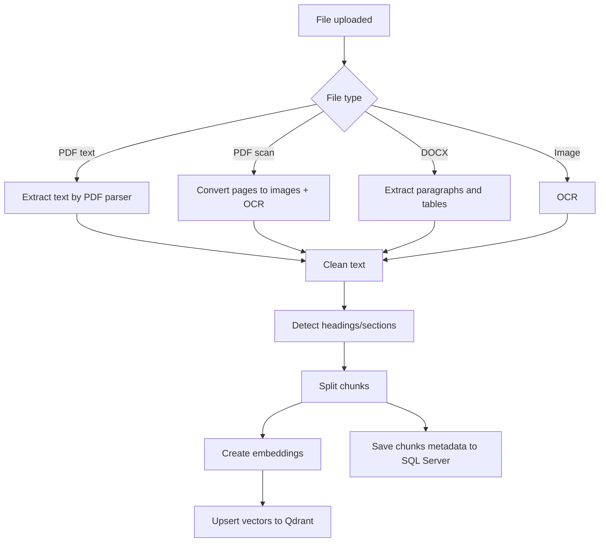
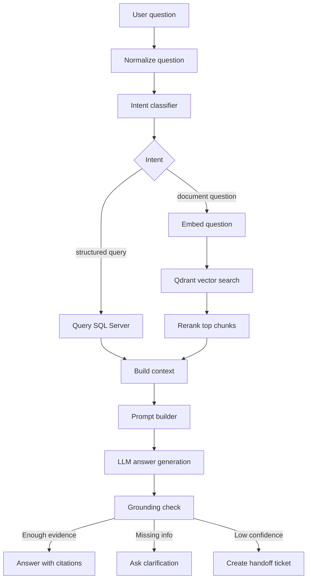

# 05. Thiết kế AI Pipeline

## 1. Mục tiêu AI

AI trong hệ thống không chỉ là LLM trả lời câu hỏi. Pipeline AI gồm nhiều module:

1. Ingestion tài liệu: đọc PDF, DOCX, ảnh.
2. OCR: trích chữ từ ảnh/PDF scan.
3. Chunking: chia tài liệu thành đoạn có metadata.
4. Embedding: biến câu hỏi/chunk thành vector.
5. Vector search: tìm chunk liên quan bằng Qdrant hoặc FAISS.
6. Intent classification: phân loại câu hỏi.
7. Reranking: xếp hạng lại chunk liên quan.
8. RAG generation: dùng LLM sinh câu trả lời có nguồn.
9. Grounding/confidence check: quyết định trả lời, hỏi lại, hoặc handoff.
10. Evaluation: đo retrieval, citation, latency, answer quality.
11. Feedback mining: khai thác feedback để cải thiện dữ liệu/model.

## 2. Kiến trúc AI service

AI service dùng Python FastAPI, chạy tách khỏi ASP.NET Core API.

```text
ai-service/
  app/
    api/
      internal_rag.py
      internal_ingestion.py
      internal_evaluation.py
    core/
      config.py
      logging.py
    ingestion/
      pdf_parser.py
      docx_parser.py
      ocr.py
      cleaner.py
      chunker.py
    rag/
      embeddings.py
      vector_store_qdrant.py
      vector_store_faiss.py
      retriever.py
      reranker.py
      prompt_builder.py
      answer_generator.py
      grounding.py
    models/
      intent_classifier.py
      schemas.py
    evaluation/
      dataset.py
      metrics.py
      runner.py
```

## 3. Document ingestion pipeline

### 3.1. Input

Nguồn input:

- Tài liệu admin upload: PDF, DOCX, PNG, JPG.
- File user upload trong chat: PDF, DOCX, PNG, JPG.
- FAQ và dữ liệu tuyển sinh từ SQL Server.

Metadata cần giữ:

- `document_id`
- `document_version_id`
- `document_type`
- `title`
- `source`
- `page_number`
- `section_title`
- `uploaded_by`
- `created_at`

### 3.2. Luồng xử lý



### 3.3. Text cleaning

Các bước làm sạch:

- Loại header/footer lặp lại.
- Chuẩn hóa khoảng trắng.
- Giữ số trang.
- Giữ bảng quan trọng ở dạng text có cấu trúc.
- Loại ký tự rác do OCR.
- Không tự sửa nội dung pháp lý nếu không có rule rõ ràng.

### 3.4. Chunking strategy

MVP:

- `chunk_size`: 600-900 tokens.
- `chunk_overlap`: 80-150 tokens.
- Ưu tiên không cắt ngang tiêu đề/mục.
- Chunk có metadata: document, page, section, type.

Quy tắc:

- Với quy chế tuyển sinh: chunk theo mục/điều/khoản nếu nhận diện được.
- Với học phí: chunk theo bảng/chương trình/năm học.
- Với FAQ: mỗi câu hỏi/đáp án là một chunk riêng.
- Với điểm chuẩn: ưu tiên query trực tiếp SQL Server, không chỉ dựa vào RAG text.

## 4. Embedding và vector search

### 4.1. Embedding model

MVP có thể dùng một embedding model pretrained. Điều cần chứng minh không phải tự train embedding từ đầu, mà là:

- Tự xây dữ liệu tuyển sinh.
- Tự chunk và index.
- Tự đánh giá retrieval.
- Tự so sánh cấu hình.

Candidate model:

- `sentence-transformers/all-MiniLM-L6-v2`: nhẹ, chạy local tốt.
- `intfloat/multilingual-e5-base`: tốt hơn cho đa ngôn ngữ nếu tài nguyên đủ.
- Embedding API bên ngoài nếu được phép, nhưng nên có phương án local để demo ổn định.

### 4.2. Qdrant collection

Collection: `admissions_docs`

Payload đề xuất:

```json
{
  "document_chunk_id": "uuid",
  "document_version_id": "uuid",
  "document_id": "uuid",
  "title": "Quy chế tuyển sinh 2026",
  "document_type": "regulation",
  "page_number": 12,
  "section_title": "Điều kiện xét tuyển",
  "content_preview": "Thí sinh cần...",
  "admission_year": 2026,
  "is_active": true
}
```

Vector:

- Distance: cosine.
- Dimension phụ thuộc embedding model.

### 4.3. FAISS benchmark

FAISS dùng để:

- Chạy prototype local nhanh.
- So sánh retrieval top-k với Qdrant.
- Benchmark nhiều chunk size/embedding model.
- Làm phần báo cáo học máy: cùng một tập golden questions, đo hit rate giữa hai backend.

FAISS không dùng làm kho chính trong production MVP vì:

- Khó quản lý metadata và persistence hơn Qdrant.
- Không tiện admin/reindex nhiều tài liệu.
- Qdrant có API và payload filter tốt hơn.

## 5. Query/RAG pipeline

### 5.1. Luồng xử lý câu hỏi



### 5.2. Intent labels

Intent classifier MVP:

| Label | Ví dụ |
|---|---|
| `tuition` | Học phí ngành CNTT bao nhiêu? |
| `cutoff_score` | Điểm chuẩn ngành Marketing năm 2025? |
| `major_info` | Ngành Khoa học dữ liệu học gì? |
| `admission_method` | Trường xét học bạ không? |
| `subject_combination` | Ngành CNTT xét tổ hợp nào? |
| `scholarship` | Có học bổng tuyển sinh không? |
| `document_lookup` | Quy chế yêu cầu hồ sơ gì? |
| `compare_programs` | So sánh CNTT và Khoa học dữ liệu |
| `handoff_request` | Tôi muốn gặp tư vấn viên |
| `out_of_scope` | Hỏi không liên quan tuyển sinh |

### 5.3. Structured data first

Một số câu hỏi phải ưu tiên SQL Server thay vì RAG:

- Điểm chuẩn.
- Học phí.
- Danh sách ngành.
- Tổ hợp xét tuyển.
- Campus.
- Trạng thái chương trình.

Lý do: dữ liệu bảng chính xác và dễ lọc hơn text PDF.

RAG dùng để bổ sung:

- Quy chế.
- Chính sách.
- Điều kiện xét tuyển.
- Hướng dẫn hồ sơ.
- Nội dung giải thích dài.

### 5.4. Reranking

MVP có 2 mức:

Mức cơ bản:

- Dùng score từ Qdrant.
- Lọc `score >= threshold`.
- Lấy top-k.

Mức nâng cao:

- Dùng cross-encoder reranker.
- Rerank top 20 còn top 5.
- So sánh có/không reranker trong evaluation.

Nếu chưa train reranker, vẫn có thể dùng pretrained reranker và tự đánh giá.

## 6. Prompt design

### 6.1. System prompt nguyên tắc

Nội dung chính:

- Bạn là trợ lý tư vấn tuyển sinh của trường.
- Chỉ trả lời trong phạm vi tuyển sinh, ngành học, học phí, điểm chuẩn, hồ sơ, học bổng.
- Dựa vào nguồn được cung cấp.
- Nếu không đủ nguồn, nói chưa đủ dữ liệu và đề xuất gặp tư vấn viên.
- Không bịa thông tin.
- Với thông tin thay đổi theo năm, luôn hỏi hoặc nêu rõ năm.
- Trả lời bằng tiếng Việt rõ ràng.

### 6.2. Prompt template rút gọn

```text
Bạn là trợ lý tuyển sinh đại học.

Quy tắc:
- Chỉ dùng CONTEXT và STRUCTURED_DATA bên dưới.
- Nếu không đủ dữ liệu, nói rõ "Hiện hệ thống chưa có đủ dữ liệu để khẳng định".
- Với dữ liệu tuyển sinh, luôn nêu năm/phương thức nếu có.
- Trích nguồn ở cuối mỗi ý quan trọng.
- Không tư vấn ngoài phạm vi tuyển sinh.

USER_PROFILE:
{user_profile}

QUESTION:
{question}

STRUCTURED_DATA:
{structured_data}

CONTEXT:
{retrieved_chunks}

Hãy trả lời ngắn gọn, chính xác, có nguồn.
```

## 7. Confidence và handoff

### 7.1. Tín hiệu confidence

Confidence có thể tính từ:

- Top retrieval score.
- Số nguồn phù hợp.
- Intent có chắc không.
- Có structured data trực tiếp không.
- LLM có trả lời dựa trên nguồn không.
- Câu hỏi có mơ hồ không.

### 7.2. Quy tắc fallback

| Điều kiện | Hành động |
|---|---|
| Không có chunk nào vượt threshold | Hỏi lại hoặc tạo handoff |
| Câu hỏi thiếu năm/ngành | Hỏi lại để làm rõ |
| Câu hỏi ngoài tuyển sinh | Từ chối lịch sự |
| User yêu cầu tư vấn viên | Tạo handoff ticket |
| AI service timeout | Trả thông báo lỗi mềm và log |
| Nội dung có thể ảnh hưởng quyết định quan trọng | Trả lời kèm nguồn và nhắc kiểm tra thông báo chính thức |

## 8. Intent classifier

### 8.1. Vì sao cần

Intent classifier chứng minh phần supervised learning, đồng thời giúp hệ thống:

- Điều hướng câu hỏi sang SQL query hay RAG.
- Ưu tiên tool phù hợp.
- Phát hiện câu hỏi ngoài phạm vi.
- Thống kê loại câu hỏi phổ biến.

### 8.2. Dataset

Nguồn dữ liệu:

- Câu hỏi do nhóm tự tạo.
- Câu hỏi từ FAQ.
- Câu hỏi chat thật sau demo.
- Feedback được admin xác nhận.

Số lượng MVP:

- 10 intent.
- Mỗi intent 30-50 câu.
- Tổng 300-500 câu là đủ demo supervised learning cơ bản.

### 8.3. Model gợi ý

Mức cơ bản:

- TF-IDF + Logistic Regression/SVM.
- Dễ train, dễ giải thích, nhanh.

Mức nâng cao:

- Fine-tune multilingual transformer nhỏ.
- Dùng cross-entropy loss, train/validation split.

### 8.4. Metrics

- Accuracy.
- Macro F1.
- Confusion matrix.
- Per-intent precision/recall.

## 9. Feedback mining

### 9.1. Dữ liệu feedback

Thu thập:

- Rating helpful/not helpful.
- Reason: wrong, outdated, no source, unclear, too long.
- Comment.
- Intent.
- Sources used.
- Retrieval score.

### 9.2. Khai phá dữ liệu

Phân tích:

- Top câu hỏi bị đánh giá thấp.
- Top intent có tỷ lệ không hữu ích cao.
- Tài liệu nào thường bị truy xuất sai.
- Chunk nào được dùng nhiều.
- Câu hỏi phổ biến theo tuần/tháng.

Kỹ thuật có thể dùng:

- Clustering embedding câu hỏi.
- Keyword extraction.
- Frequency analysis.
- Topic grouping thủ công hoặc bán tự động.

## 10. Evaluation design

### 10.1. Golden question dataset

Tối thiểu 50 câu, tốt hơn 100 câu.

Phân bổ:

| Category | Số câu tối thiểu |
|---|---:|
| Học phí | 10 |
| Điểm chuẩn | 10 |
| Ngành/chương trình | 10 |
| Tổ hợp/phương thức xét tuyển | 10 |
| Hồ sơ/quy chế | 10 |
| Học bổng/chính sách | 5 |
| So sánh ngành | 5 |
| Ngoài phạm vi/thiếu dữ liệu | 5 |

### 10.2. Retrieval metrics

- `hit@k`: nguồn đúng có nằm trong top-k không.
- `mrr`: nguồn đúng đứng thứ mấy.
- `avg_similarity_score`.
- `retrieval_latency_ms`.

### 10.3. Answer metrics

Chấm tự động hoặc bán thủ công:

- Citation correctness.
- Groundedness.
- Completeness.
- Helpfulness.
- Latency.
- Handoff rate.

Thang điểm thủ công 0-10:

- 0-3: sai hoặc bịa.
- 4-6: đúng một phần, thiếu nguồn/thiếu ý.
- 7-8: đúng, có nguồn, còn thiếu chi tiết nhỏ.
- 9-10: đúng, đầy đủ, rõ ràng, có nguồn chuẩn.

### 10.4. Thí nghiệm so sánh

Các cấu hình nên so sánh:

| Experiment | A | B |
|---|---|---|
| Chunk size | 500 | 900 |
| Top-k | 3 | 5 |
| Vector backend | FAISS | Qdrant |
| Embedding model | MiniLM | multilingual-e5 |
| Reranking | Không | Có |
| Structured-first | Không | Có |

Kết quả cần báo cáo:

- Bảng metrics.
- Nhận xét cấu hình tốt nhất.
- Ví dụ câu trả lời sai và cách cải thiện.

## 11. OCR và file upload trong chat

### 11.1. Tài liệu tri thức admin upload

Tài liệu này được đưa vào kho RAG chung.

Ví dụ:

- Quy chế tuyển sinh.
- File học phí.
- Thông báo xét tuyển.
- FAQ chính thức.

### 11.2. File user upload trong chat

File user upload không mặc định đưa vào kho RAG chung. Nó chỉ dùng làm ngữ cảnh của hội thoại.

Ví dụ:

- Ảnh học bạ.
- PDF thông báo người dùng gửi.
- DOCX câu hỏi/hồ sơ.

Quy tắc:

- Parse/OCR file.
- Lưu extracted text trong `attachments`.
- Đưa text vào context tạm của câu hỏi.
- Không index vào Qdrant chung trừ khi admin duyệt.

## 12. Không chỉ LLM: cách trình bày khi bảo vệ

Khi thầy hỏi "có phải chỉ gọi LLM không?", trả lời theo hướng:

- LLM chỉ là bước cuối để diễn đạt câu trả lời.
- Hệ thống tự xây kho dữ liệu tuyển sinh.
- Hệ thống tự xử lý PDF/DOCX/ảnh.
- Hệ thống tự chunk và embedding tài liệu.
- Hệ thống tự tìm kiếm vector bằng Qdrant/FAISS.
- Hệ thống có intent classifier để phân loại câu hỏi.
- Hệ thống có evaluation dataset và so sánh cấu hình.
- Hệ thống dùng feedback để khai phá câu hỏi lỗi/phổ biến.

## 13. Rủi ro AI

| Rủi ro | Cách giảm |
|---|---|
| Hallucination | Bắt buộc citation, confidence threshold |
| Retrieval sai | Evaluation hit@k, rerank, cải thiện chunking |
| Dữ liệu cũ | Document versioning, admission cycle |
| OCR sai | Preview text, admin duyệt, cảnh báo confidence thấp |
| LLM timeout | Timeout + retry + fallback handoff |
| Privacy | Không gửi dữ liệu nhạy cảm ra model ngoài nếu không được phép |
| Không đủ dữ liệu train | Bắt đầu bằng rule/TF-IDF, dần bổ sung feedback |

## 14. Output cần có trong báo cáo AI

- Mô tả pipeline ingestion.
- Mô tả vector search Qdrant/FAISS.
- Mô tả intent classifier.
- Mô tả RAG prompt.
- Bảng golden questions.
- Bảng kết quả retrieval.
- Bảng kết quả answer quality.
- So sánh ít nhất 2 cấu hình.
- Phân tích lỗi và hướng cải thiện.

