# 06. Bộ sơ đồ thiết kế

## 1. Use Case Diagram

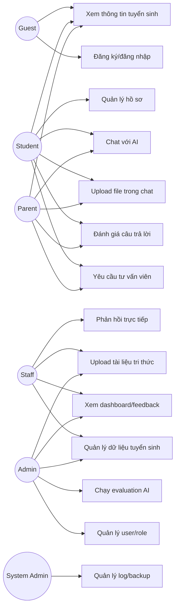

## 2. Kiến trúc tổng thể

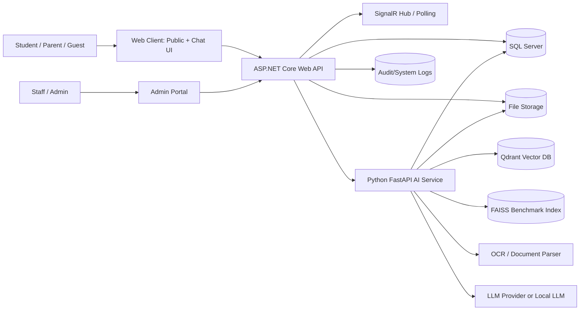

## 3. Deployment local bằng Docker Compose

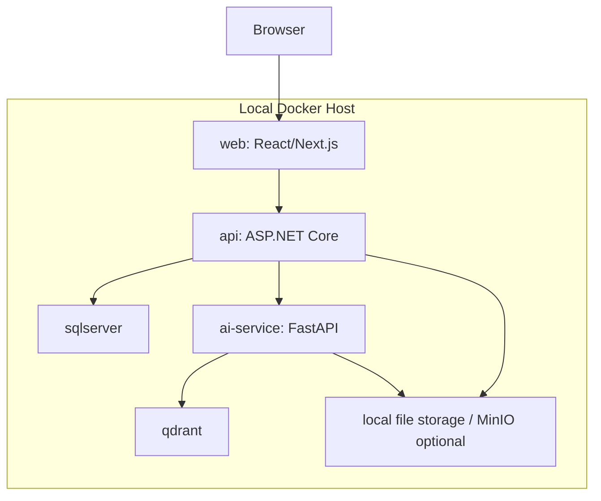

## 4. ERD rút gọn

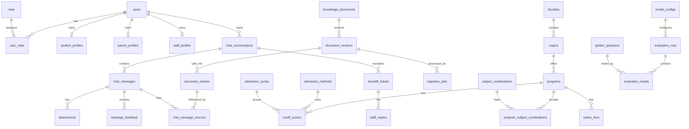

## 5. Sequence: Chat RAG

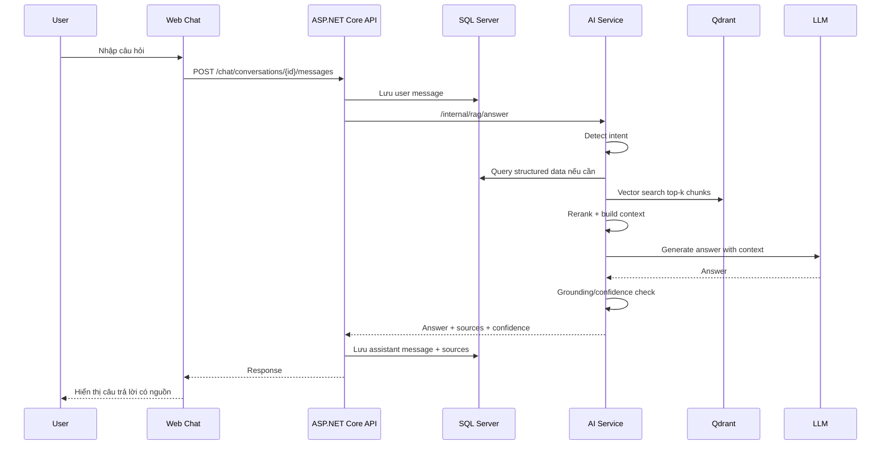

## 6. Activity: Upload tài liệu tri thức

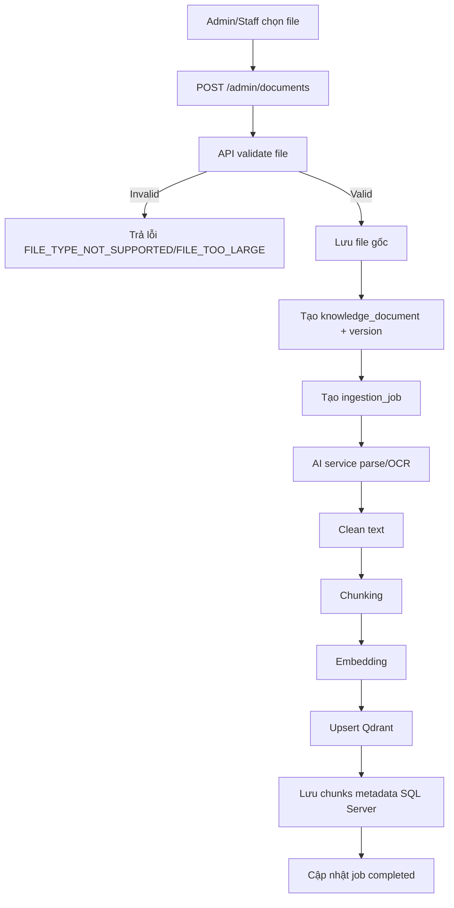

## 7. Sequence: Staff handoff

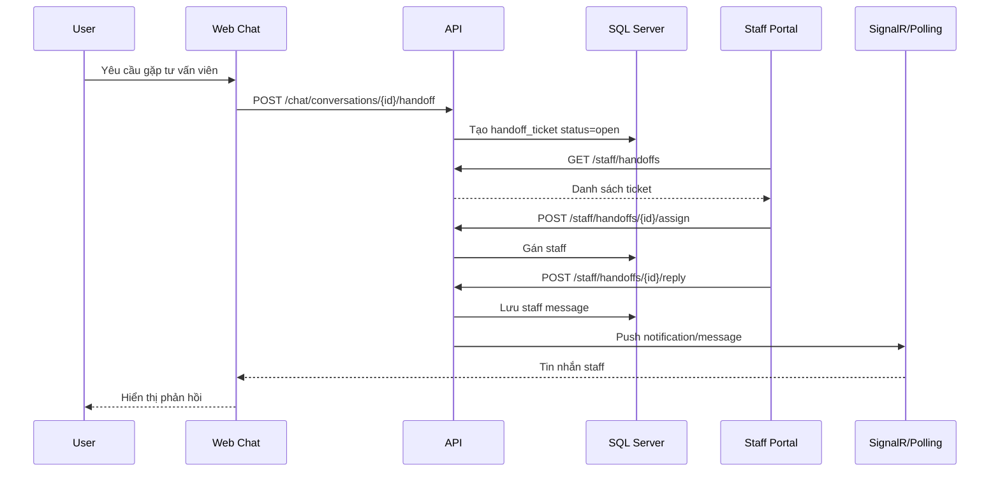

## 8. Activity: Evaluation AI

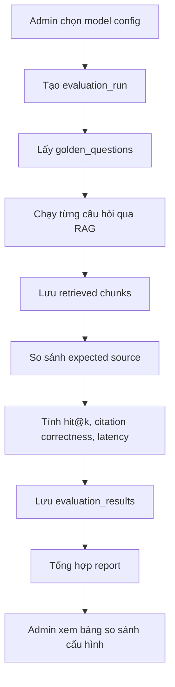

## 9. State: Handoff ticket

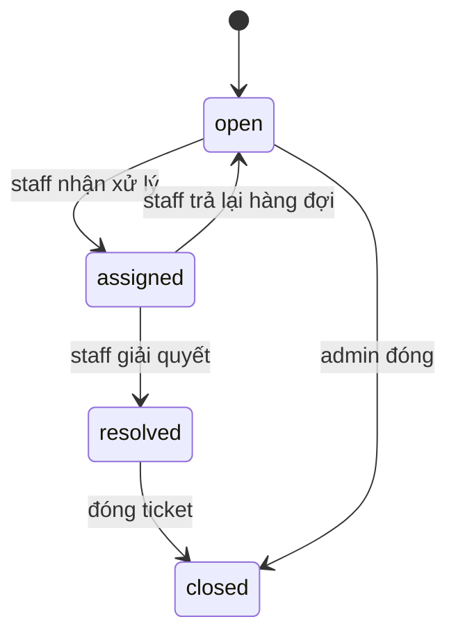

## 10. State: Document ingestion

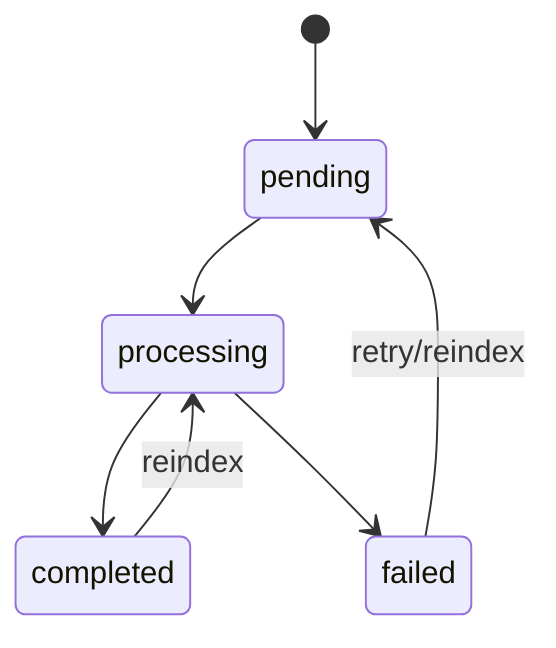

## 11. Component: Backend modular monolith

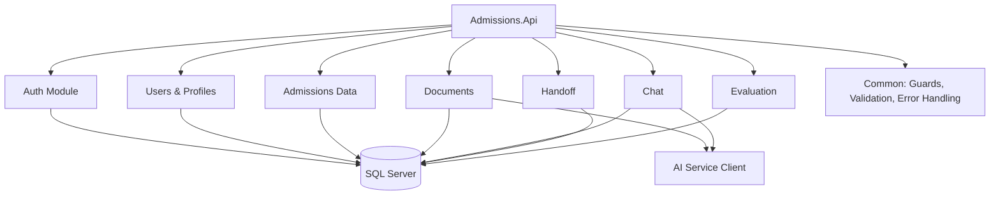

