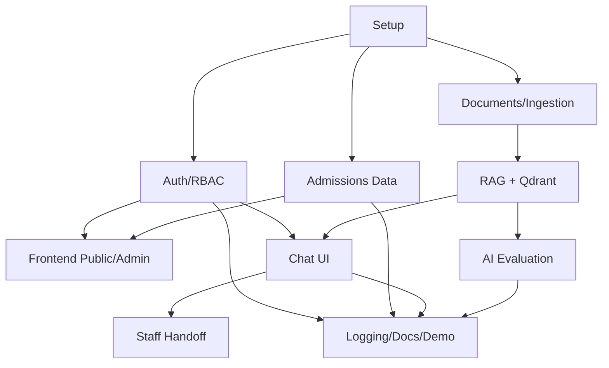

# 08. Implementation Backlog

## 1. Quy ước task

Priority:

- P0: bắt buộc cho MVP.
- P1: nên có để demo tốt.
- P2: mở rộng nếu còn thời gian.

Status:

- Todo.
- In Progress.
- Done.
- Blocked.

Definition of Done chung:

- Code build được.
- Có validation cơ bản.
- Có xử lý lỗi.
- Có log ở điểm quan trọng.
- API có Swagger.
- Có test hoặc checklist test thủ công.
- Không hard-code secret.

## 2. Epic E0: Chuẩn bị dữ liệu và POC

| ID | Task | Priority | Output |
|---|---|---|---|
| E0-01 | Thu thập tài liệu tuyển sinh mẫu PDF/DOCX/ảnh | P0 | `data/sample_documents/` |
| E0-02 | Tạo seed ngành/chương trình/điểm chuẩn/học phí | P0 | CSV/XLSX seed |
| E0-03 | Tạo 50 golden questions đầu tiên | P0 | `golden_questions.csv` |
| E0-04 | Prototype parse PDF text | P0 | Script parse PDF |
| E0-05 | Prototype parse DOCX | P0 | Script parse DOCX |
| E0-06 | Prototype OCR ảnh rõ chữ | P1 | Script OCR |
| E0-07 | Prototype embedding + FAISS search | P1 | Notebook/script benchmark |
| E0-08 | Prototype Qdrant upsert/search | P0 | Qdrant demo script |

## 3. Epic E1: Project setup

| ID | Task | Priority | Output |
|---|---|---|---|
| E1-01 | Tạo repository structure | P0 | `apps/`, `docs/`, `infra/`, `scripts/` |
| E1-02 | Tạo ASP.NET Core solution | P0 | Backend build được |
| E1-03 | Tạo React/Next.js app | P0 | Frontend chạy được |
| E1-04 | Tạo FastAPI ai-service | P0 | `/health` OK |
| E1-05 | Tạo Docker Compose SQL Server + Qdrant | P0 | DB/vector chạy local |
| E1-06 | Tạo `.env.example` | P0 | Env mẫu |
| E1-07 | Tạo Swagger/OpenAPI | P0 | Swagger mở được |
| E1-08 | Tạo README chạy local | P0 | Hướng dẫn setup |
| E1-09 | Setup linter/formatter backend | P1 | Code style |
| E1-10 | Setup linter/formatter frontend | P1 | Code style |

## 4. Epic E2: Auth/RBAC

| ID | Task | Priority | Output |
|---|---|---|---|
| E2-01 | Tạo entities users/roles/user_roles | P0 | EF entities |
| E2-02 | Tạo profiles entities | P0 | student/parent/staff profiles |
| E2-03 | Tạo migration identity | P0 | SQL Server schema |
| E2-04 | Seed roles | P0 | student/parent/staff/admin |
| E2-05 | Seed admin demo | P0 | Admin login được |
| E2-06 | Implement password hashing | P0 | Hash service |
| E2-07 | Khóa self-register student, seed tài khoản BIT | P0 | `/auth/register-student` trả `STUDENT_SELF_REGISTER_DISABLED`; seed `BIT######@st.cmcu.edu.vn` |
| E2-08 | API register parent | P0 | `/auth/register-parent` |
| E2-09 | API login | P0 | JWT + refresh token |
| E2-10 | API refresh token | P0 | Token refresh |
| E2-11 | API logout | P0 | Revoke refresh token |
| E2-12 | API `/auth/me` | P0 | Current user |
| E2-13 | RBAC authorization policy | P0 | Role guard |
| E2-14 | Admin create staff | P0 | Staff account |
| E2-15 | Admin lock/unlock user | P1 | User status |
| E2-16 | Profile get/update | P0 | `/profiles/me` |
| E2-17 | Auth tests/checklist | P0 | Test login/roles |

## 5. Epic E3: Admissions data

| ID | Task | Priority | Output |
|---|---|---|---|
| E3-01 | Entities admission_cycles/faculties/majors | P0 | EF entities |
| E3-02 | Entities programs/subject_combinations | P0 | EF entities |
| E3-03 | Entities methods/cutoff_scores/tuition_fees | P0 | EF entities |
| E3-04 | Entities scholarships/faqs | P1 | EF entities |
| E3-05 | Migration admissions schema | P0 | SQL schema |
| E3-06 | Seed faculties/majors/programs | P0 | Demo data |
| E3-07 | Seed cutoff scores/tuition/FAQ | P0 | Demo data |
| E3-08 | Public API list majors | P0 | `GET /majors` |
| E3-09 | Public API major detail | P0 | `GET /majors/{id}` |
| E3-10 | Public API cutoff scores | P0 | `GET /cutoff-scores` |
| E3-11 | Public API tuition fees | P0 | `GET /tuition-fees` |
| E3-12 | Admin CRUD majors | P0 | Admin endpoints |
| E3-13 | Admin CRUD programs | P0 | Admin endpoints |
| E3-14 | Admin CRUD cutoff scores | P0 | Admin endpoints |
| E3-15 | Admin CRUD tuition fees | P0 | Admin endpoints |
| E3-16 | API compare programs | P1 | `POST /admissions/compare` |
| E3-17 | Validation and error codes | P0 | Standard errors |

## 6. Epic E4: Frontend public/admin

| ID | Task | Priority | Output |
|---|---|---|---|
| E4-01 | Setup routing/layout | P0 | Base UI |
| E4-02 | Login/register pages | P0 | Auth UI |
| E4-03 | Auth state/token handling | P0 | Protected routes |
| E4-04 | Public majors list page | P0 | Search/filter |
| E4-05 | Major detail page | P0 | Detail UI |
| E4-06 | Cutoff/tuition lookup page | P1 | Lookup UI |
| E4-07 | Admin dashboard shell | P0 | Admin layout |
| E4-08 | Admin majors CRUD UI | P0 | Data management |
| E4-09 | Admin programs CRUD UI | P0 | Data management |
| E4-10 | Admin cutoff/tuition CRUD UI | P0 | Data management |
| E4-11 | Admin FAQ UI | P1 | FAQ management |
| E4-12 | Responsive polish | P1 | Mobile usable |

## 7. Epic E5: Documents and ingestion

| ID | Task | Priority | Output |
|---|---|---|---|
| E5-01 | Entities documents/versions/chunks/jobs | P0 | EF entities |
| E5-02 | Migration document schema | P0 | SQL schema |
| E5-03 | File storage service | P0 | Save uploaded files |
| E5-04 | Admin upload document API | P0 | `POST /admin/documents` |
| E5-05 | List/detail documents API | P0 | Admin docs |
| E5-06 | Reindex/status API | P1 | Reprocess docs |
| E5-07 | AI internal ingest endpoint | P0 | `/internal/documents/ingest` |
| E5-08 | PDF parser | P0 | Extract text |
| E5-09 | DOCX parser | P0 | Extract text |
| E5-10 | OCR image/PDF scan | P1 | Extract text OCR |
| E5-11 | Text cleaner | P0 | Clean text |
| E5-12 | Chunker | P0 | Chunk text |
| E5-13 | Save chunks metadata to SQL | P0 | document_chunks |
| E5-14 | Admin document UI | P0 | Upload/status |
| E5-15 | Ingestion job logs | P1 | Debug failed jobs |

## 8. Epic E6: RAG + Qdrant/FAISS

| ID | Task | Priority | Output |
|---|---|---|---|
| E6-01 | Choose embedding model baseline | P0 | Model config |
| E6-02 | Implement embedding service | P0 | Text -> vector |
| E6-03 | Setup Qdrant collection | P0 | `admissions_docs` |
| E6-04 | Upsert document chunks to Qdrant | P0 | Vectors stored |
| E6-05 | Qdrant retrieval top-k | P0 | Search chunks |
| E6-06 | FAISS local benchmark path | P1 | Offline index |
| E6-07 | Structured SQL retrieval for tuition/score | P0 | DB-first answers |
| E6-08 | Prompt builder | P0 | RAG prompt |
| E6-09 | LLM connector | P0 | Answer generation |
| E6-10 | Source/citation mapper | P0 | Sources in response |
| E6-11 | Confidence/grounding checker | P0 | Handoff/clarify |
| E6-12 | Internal RAG answer endpoint | P0 | `/internal/rag/answer` |
| E6-13 | Backend chat calls AI service | P0 | API integration |

## 9. Epic E7: Chat UI and feedback

| ID | Task | Priority | Output |
|---|---|---|---|
| E7-01 | Entities conversations/messages/sources | P0 | EF entities |
| E7-02 | Entities attachments/feedback | P0 | EF entities |
| E7-03 | Migration chat schema | P0 | SQL schema |
| E7-04 | API create/list conversations | P0 | Chat endpoints |
| E7-05 | API get conversation detail | P0 | Messages |
| E7-06 | API send message | P0 | RAG response |
| E7-07 | API upload chat attachment | P0 | File in chat |
| E7-08 | API feedback message | P0 | Feedback stored |
| E7-09 | Chat sidebar UI | P0 | Conversations |
| E7-10 | Chat message UI | P0 | ChatGPT-like view |
| E7-11 | Chat input/upload UI | P0 | Send/upload |
| E7-12 | Sources display UI | P0 | Citations |
| E7-13 | Feedback buttons UI | P0 | Helpful/not helpful |
| E7-14 | Loading/typing state | P1 | Better UX |

## 10. Epic E8: Staff handoff

| ID | Task | Priority | Output |
|---|---|---|---|
| E8-01 | Entities handoff_tickets/staff_replies | P0 | EF entities |
| E8-02 | Migration handoff schema | P0 | SQL schema |
| E8-03 | API create handoff | P0 | User request |
| E8-04 | Staff list handoffs API | P0 | Queue |
| E8-05 | Staff assign ticket API | P0 | Assign |
| E8-06 | Staff reply API | P0 | Reply message |
| E8-07 | Staff update status API | P0 | Resolve/close |
| E8-08 | Staff handoff UI | P0 | Queue/detail |
| E8-09 | User sees staff reply | P0 | In chat |
| E8-10 | SignalR realtime | P1 | Realtime reply |
| E8-11 | Polling fallback | P0 | MVP fallback |

## 11. Epic E9: AI evaluation and training nhỏ

| ID | Task | Priority | Output |
|---|---|---|---|
| E9-01 | Entities model_configs/prompt_versions | P0 | EF entities |
| E9-02 | Entities golden/evaluation tables | P0 | EF entities |
| E9-03 | Migration evaluation schema | P0 | SQL schema |
| E9-04 | Admin CRUD model configs | P1 | Config UI/API |
| E9-05 | Admin CRUD golden questions | P0 | Dataset |
| E9-06 | Evaluation runner | P0 | Run questions |
| E9-07 | Retrieval hit@k metric | P0 | Metric |
| E9-08 | Citation correctness field/manual score | P0 | Manual eval |
| E9-09 | Evaluation report UI | P1 | Results |
| E9-10 | Intent training examples table/API | P1 | Dataset |
| E9-11 | Train TF-IDF + Logistic Regression classifier | P1 | Baseline classifier |
| E9-12 | Intent classifier metrics | P1 | Accuracy/F1/confusion |
| E9-13 | Compare FAISS vs Qdrant | P1 | Benchmark report |
| E9-14 | Compare chunk/top-k configs | P1 | Experiment report |

## 12. Epic E10: Logging, testing, docs, demo

| ID | Task | Priority | Output |
|---|---|---|---|
| E10-01 | Global exception middleware | P0 | Standard errors |
| E10-02 | Request logging | P1 | API logs |
| E10-03 | Audit logging admin actions | P0 | audit_logs |
| E10-04 | System logs for ingestion/AI errors | P0 | system_logs |
| E10-05 | Backend unit/integration tests critical flows | P1 | Tests |
| E10-06 | Frontend smoke test checklist | P0 | Manual checklist |
| E10-07 | AI evaluation report document | P0 | Report |
| E10-08 | README final | P0 | Run guide |
| E10-09 | API documentation export | P1 | Swagger/OpenAPI |
| E10-10 | Database schema document update | P0 | Final schema |
| E10-11 | User manual | P1 | Guide |
| E10-12 | Slide deck outline | P0 | Presentation |
| E10-13 | Demo script | P0 | Defense flow |
| E10-14 | Demo video | P1 | Backup demo |

## 13. Dependency map

## 14. MVP task cut

Nếu thời gian gấp, giữ các task P0 sau:

- E1 setup.
- E2 auth/RBAC.
- E3 admissions CRUD.
- E4 public/admin UI cơ bản.
- E5 PDF/DOCX ingestion, OCR ảnh có thể P1.
- E6 Qdrant RAG answer with citations.
- E7 chat UI + feedback.
- E8 handoff bằng polling, chưa cần SignalR.
- E9 golden questions + evaluation runs cơ bản.
- E10 README/demo/report.

Các task có thể lùi:

- OAuth2 login.
- SignalR realtime.
- Advanced OCR.
- Fine-tune transformer.
- Complex dashboard.
- Export PDF report.
- Multi-tenant.
