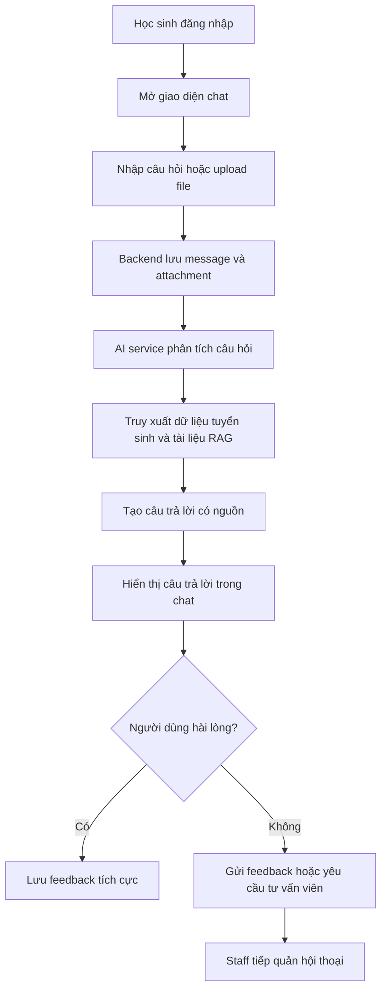
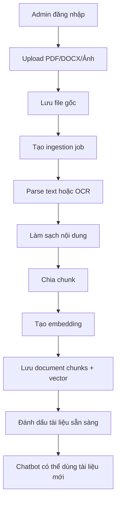
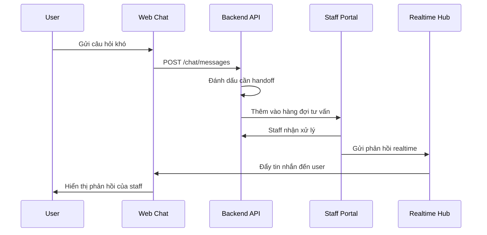
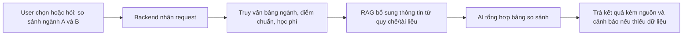
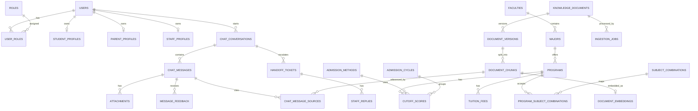
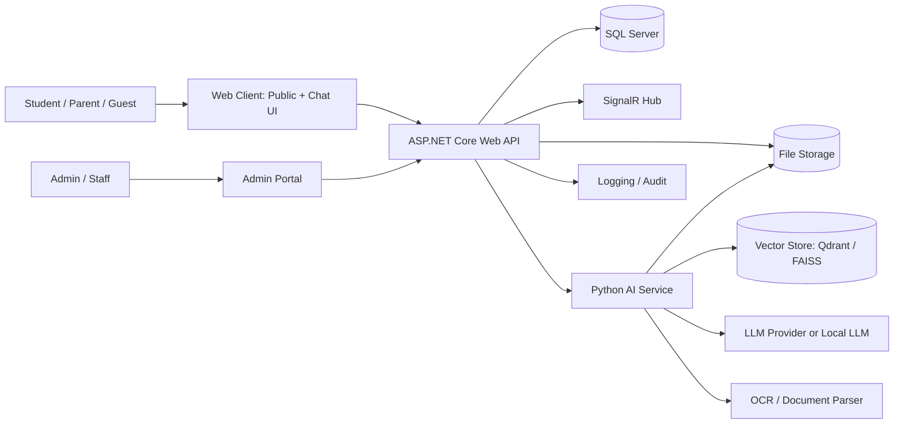
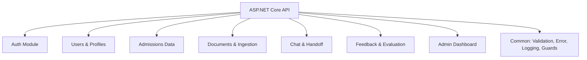
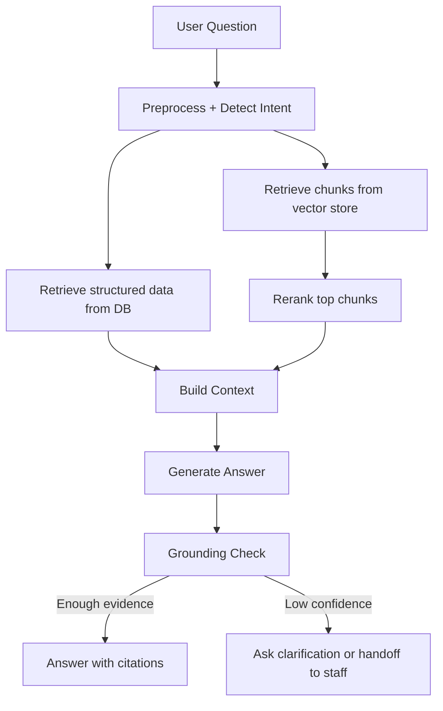
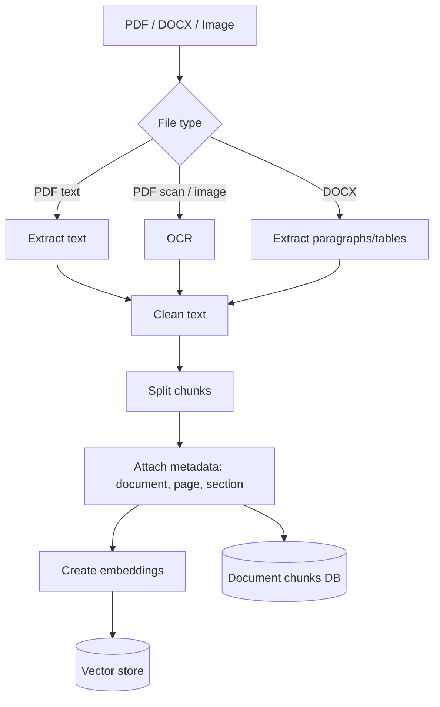

# Thiết kế tiền dự án: Hệ thống Tư vấn Tuyển sinh Đại học

## 1. Hiểu rõ bài toán

### 1.1. Dự án giải quyết vấn đề gì?

Học sinh và phụ huynh thường cần hỏi nhiều thông tin tuyển sinh: ngành học, tổ hợp xét tuyển, điểm chuẩn, học phí, học bổng, phương thức xét tuyển, mốc thời gian, hồ sơ cần nộp, chính sách ưu tiên. Thông tin này nằm rải rác trong website, PDF quy chế, file học phí, thông báo tuyển sinh, bài viết FAQ và nhân sự tư vấn.

Dự án cần xây dựng một hệ thống tư vấn tuyển sinh có 3 lớp:

1. Cổng thông tin tuyển sinh để người dùng tra cứu ngành, điểm chuẩn, học phí, quy chế.
2. Cổng quản trị để nhà trường quản lý dữ liệu, tài liệu, người dùng, hội thoại và phản hồi.
3. Trợ lý AI dạng ChatGPT nội bộ, có khả năng đọc tài liệu tuyển sinh, nhận file/hình ảnh, trả lời có căn cứ, so sánh ngành/thông tin và chuyển tiếp cho tư vấn viên khi cần.

### 1.2. Ai là người dùng?

| Nhóm người dùng | Mục tiêu chính |
|---|---|
| Khách vãng lai | Xem ngành, điểm chuẩn, học phí, hỏi chatbot cơ bản |
| Học sinh | Tạo tài khoản, hỏi tư vấn cá nhân hóa, lưu lịch sử chat, tải file/hình ảnh để hỏi |
| Phụ huynh | Theo dõi thông tin tuyển sinh, hỏi học phí/chính sách/hồ sơ, lưu hội thoại |
| Nhân viên tư vấn nhà trường | Xem hội thoại, phản hồi trực tiếp, tiếp nhận câu hỏi khó |
| Quản trị viên tuyển sinh | Quản lý ngành, điểm chuẩn, tài liệu, tài khoản, phân quyền, cấu hình AI |
| Quản trị hệ thống | Quản lý cấu hình, log, backup, bảo mật, deployment |

### 1.3. Người dùng cần làm những thao tác nào?

- Xem danh sách ngành/chương trình đào tạo.
- Tìm kiếm ngành theo tên, mã ngành, tổ hợp, mức điểm, học phí.
- Xem điểm chuẩn theo năm/phương thức xét tuyển.
- Xem học phí, học bổng, chỉ tiêu, campus, thời gian tuyển sinh.
- Đăng ký/đăng nhập bằng vai trò học sinh, phụ huynh, nhà trường.
- Chat với trợ lý AI theo giao diện giống ChatGPT.
- Tải PDF, Word, ảnh chụp học bạ/thông báo/quy chế để hỏi.
- Yêu cầu AI so sánh ngành, phương thức xét tuyển, học phí, điểm chuẩn.
- Đánh giá câu trả lời: đúng/sai/hữu ích/không hữu ích.
- Gửi yêu cầu gặp tư vấn viên khi AI không đủ chắc chắn.
- Nhà trường xem hội thoại, phản hồi trực tiếp, cập nhật tài liệu và dữ liệu tuyển sinh.

### 1.4. Kết quả cuối cùng cần đạt

MVP tốt cho đồ án nên đạt được:

- Website public có danh sách ngành, điểm chuẩn, học phí, tìm kiếm/lọc.
- Hệ thống tài khoản và phân quyền: student, parent, staff, admin.
- Giao diện chat giống ChatGPT: sidebar lịch sử, ô nhập, streaming/fake streaming, upload file, hiển thị nguồn trích dẫn.
- RAG chatbot đọc từ tài liệu tuyển sinh PDF/DOCX và dữ liệu database.
- Admin upload tài liệu, hệ thống tự trích text, chia chunk, tạo embedding, lưu vào vector store.
- Chatbot trả lời kèm nguồn: tên tài liệu, trang/chunk, độ tin cậy.
- Admin xem feedback, hội thoại, câu hỏi chưa trả lời tốt.
- Module tư vấn viên phản hồi trực tiếp hoặc tiếp quản hội thoại.
- Có báo cáo đánh giá AI: bộ câu hỏi test, accuracy/top-k retrieval, hallucination cases, so sánh ít nhất 2 cấu hình/model.

### 1.5. Những gì không nằm trong phạm vi dự án

- Không tự huấn luyện một LLM lớn từ đầu như ChatGPT. Việc này vượt quá tài nguyên đồ án.
- Không đảm bảo tư vấn pháp lý/tuyển sinh có giá trị thay thế thông báo chính thức.
- Không tự động crawl toàn bộ dữ liệu mọi trường đại học nếu chưa kiểm soát nguồn.
- Không làm app mobile native trong giai đoạn đầu.
- Không tích hợp thanh toán lệ phí xét tuyển.
- Không xử lý mọi định dạng file phức tạp; MVP ưu tiên PDF, DOCX, ảnh rõ chữ.
- Không triển khai microservices phức tạp ngay từ đầu nếu chưa có nhu cầu tải lớn.

## 2. Phạm vi MVP và phạm vi mở rộng

### 2.1. MVP bắt buộc

1. Auth/RBAC: đăng ký, đăng nhập, JWT, refresh token, phân quyền.
2. Public portal: ngành, điểm chuẩn, học phí, quy chế, FAQ.
3. Admin portal: CRUD ngành, chương trình, điểm chuẩn, học phí, tài liệu, người dùng.
4. Chat portal: giao diện giống ChatGPT, lưu hội thoại, upload file.
5. RAG pipeline: upload tài liệu tuyển sinh, parse, chunk, embedding, search, answer with citations.
6. Feedback: người dùng đánh giá câu trả lời, admin xem feedback.
7. Human handoff: staff xem câu hỏi và phản hồi trực tiếp.
8. Evaluation: bộ test câu hỏi tuyển sinh và báo cáo so sánh cấu hình AI.

### 2.2. Nâng cao nếu còn thời gian

- OCR ảnh học bạ/thông báo.
- So sánh ngành thông minh theo điểm, học phí, sở thích, tổ hợp.
- Dashboard thống kê câu hỏi phổ biến.
- Gợi ý ngành cá nhân hóa dựa trên điểm/khối/sở thích.
- Fine-tune hoặc train intent classifier/reranker nhỏ từ feedback.
- Multi-turn memory có kiểm soát.
- Export báo cáo tư vấn PDF.

## 3. Yêu cầu chức năng

### 3.1. Module tài khoản và phân quyền

- Đăng ký tài khoản học sinh.
- Đăng ký tài khoản phụ huynh.
- Nhà trường tạo tài khoản staff/admin.
- Đăng nhập bằng email/password.
- Đổi mật khẩu.
- Quên mật khẩu.
- Cập nhật hồ sơ cá nhân.
- Gán vai trò: student, parent, staff, admin.
- Khóa/mở khóa tài khoản.
- Ghi log đăng nhập và thao tác quản trị.

### 3.2. Module hồ sơ người dùng

Học sinh:

- Lưu họ tên, lớp/trường THPT, tỉnh/thành, năm tuyển sinh.
- Lưu điểm dự kiến hoặc điểm thi.
- Lưu tổ hợp xét tuyển quan tâm.
- Lưu ngành yêu thích.

Phụ huynh:

- Lưu thông tin liên hệ.
- Có thể liên kết với hồ sơ học sinh nếu cần.

Nhà trường:

- Lưu phòng ban, chức vụ, quyền phản hồi, quyền quản trị dữ liệu.

### 3.3. Module thông tin tuyển sinh

- CRUD ngành học.
- CRUD chương trình đào tạo.
- CRUD phương thức xét tuyển.
- CRUD tổ hợp môn.
- CRUD điểm chuẩn theo năm/ngành/phương thức.
- CRUD học phí theo chương trình/năm học.
- CRUD học bổng/chính sách ưu đãi.
- CRUD FAQ tuyển sinh.
- Tìm kiếm ngành theo từ khóa.
- Lọc ngành theo tổ hợp, khoảng điểm, học phí, campus.
- Xem chi tiết ngành: mô tả, chuẩn đầu ra, cơ hội nghề nghiệp, học phí, điểm chuẩn.
- So sánh nhiều ngành theo điểm chuẩn, học phí, tổ hợp, chỉ tiêu.

### 3.4. Module tài liệu tuyển sinh

- Admin upload PDF/DOCX/ảnh.
- Lưu metadata: loại tài liệu, năm, phiên bản, người upload.
- Tự động trích xuất text.
- OCR ảnh hoặc PDF scan nếu cần.
- Chia nội dung thành chunk.
- Tạo embedding cho từng chunk.
- Lưu chunk vào vector store.
- Cho phép bật/tắt tài liệu khỏi kho tri thức.
- Cho phép xem trạng thái xử lý: pending, processing, completed, failed.
- Cho phép tái index tài liệu khi cập nhật.

### 3.5. Module chat AI giống ChatGPT

- Tạo hội thoại mới.
- Xem danh sách hội thoại cũ.
- Đổi tên/xóa/lưu trữ hội thoại.
- Gửi tin nhắn text.
- Upload file PDF/DOCX/ảnh trong hội thoại.
- AI trả lời theo ngữ cảnh tuyển sinh.
- AI hiển thị nguồn tham khảo.
- AI hỏi lại khi thiếu thông tin.
- AI từ chối trả lời khi ngoài phạm vi hoặc không có nguồn chắc chắn.
- AI có thể so sánh ngành/chính sách nếu dữ liệu có trong hệ thống.
- Lưu toàn bộ message, token usage, latency, nguồn đã dùng.
- Người dùng đánh giá câu trả lời.

### 3.6. Module phản hồi trực tiếp của nhà trường

- Staff xem hàng đợi câu hỏi cần hỗ trợ.
- Staff tiếp quản hội thoại từ AI.
- Staff gửi tin nhắn trực tiếp cho người dùng.
- User nhận phản hồi realtime.
- Đánh dấu trạng thái: open, pending, resolved, closed.
- Ghi nhận người xử lý và thời gian xử lý.

### 3.7. Module feedback và cải thiện AI

- Người dùng đánh giá câu trả lời: like/dislike, lý do, ghi chú.
- Admin xem các câu trả lời bị đánh giá thấp.
- Admin tạo cặp câu hỏi - câu trả lời chuẩn.
- Admin đánh dấu nguồn đúng/sai.
- Hệ thống xuất tập test/evaluation dataset.
- So sánh các cấu hình:
  - embedding model A vs B.
  - chunk size A vs B.
  - top-k retrieval A vs B.
  - có reranker vs không reranker.
- Báo cáo chỉ số:
  - retrieval hit rate.
  - answer groundedness.
  - citation correctness.
  - response latency.
  - user helpfulness rate.

### 3.8. Module dashboard quản trị

- Thống kê số người dùng.
- Thống kê số hội thoại.
- Top câu hỏi phổ biến.
- Top tài liệu được truy xuất.
- Tỷ lệ câu trả lời hữu ích.
- Số câu hỏi cần staff xử lý.
- Số lỗi ingestion tài liệu.
- Log hệ thống và audit log.

## 4. Yêu cầu phi chức năng

| Nhóm | Yêu cầu đề xuất cho đồ án |
|---|---|
| Hiệu năng API | API thường phản hồi dưới 1 giây trong môi trường demo |
| Hiệu năng chat | RAG trả lời trong 5-15 giây tùy model; hiển thị trạng thái đang xử lý |
| Đồng thời | MVP chịu 50-100 user đồng thời, 5-10 phiên chat AI đồng thời |
| Bảo mật | JWT, RBAC, hash password, HTTPS khi deploy, validate upload, audit log |
| Riêng tư | Không lộ hồ sơ học sinh/phụ huynh cho user khác |
| Tin cậy AI | Câu trả lời tuyển sinh phải kèm nguồn; không có nguồn thì nói không chắc |
| Backup | Backup database và thư mục upload theo lịch |
| Mobile | Responsive trên desktop/tablet/mobile |
| Khả dụng | Docker Compose chạy được toàn bộ hệ thống local/demo |
| Logging | Log API request, lỗi hệ thống, ingestion, AI latency |
| Monitoring | Tối thiểu có dashboard log/health check |
| Khả năng mở rộng | Modular monolith, tách AI service riêng để dễ nâng cấp |
| Bảo trì | Có README, API docs, DB schema, convention, seed data |

## 5. Luồng người dùng chính

### 5.1. Luồng học sinh hỏi chatbot



### 5.2. Luồng admin cập nhật tài liệu tuyển sinh



### 5.3. Luồng staff phản hồi trực tiếp



### 5.4. Luồng so sánh ngành



## 6. Thiết kế database

### 6.1. Các nhóm bảng chính

Nhóm Identity:

- `users`
- `roles`
- `user_roles`
- `student_profiles`
- `parent_profiles`
- `staff_profiles`
- `refresh_tokens`
- `login_logs`

Nhóm tuyển sinh:

- `admission_cycles`
- `faculties`
- `majors`
- `programs`
- `subject_combinations`
- `program_subject_combinations`
- `admission_methods`
- `cutoff_scores`
- `tuition_fees`
- `scholarships`
- `faqs`

Nhóm tài liệu/RAG:

- `knowledge_documents`
- `document_versions`
- `document_chunks`
- `document_embeddings`
- `ingestion_jobs`
- `extracted_entities`

Nhóm chat:

- `chat_conversations`
- `chat_messages`
- `chat_message_sources`
- `attachments`
- `message_feedback`
- `handoff_tickets`
- `staff_replies`

Nhóm đánh giá AI:

- `golden_questions`
- `evaluation_runs`
- `evaluation_results`
- `model_configs`
- `prompt_versions`

Nhóm vận hành:

- `audit_logs`
- `system_logs`
- `notifications`

### 6.2. ERD rút gọn



### 6.3. Bảng quan trọng và trường chính

`users`

- `id`
- `email`
- `password_hash`
- `full_name`
- `phone`
- `status`
- `created_at`
- `updated_at`

`student_profiles`

- `user_id`
- `high_school`
- `province`
- `graduation_year`
- `expected_score`
- `interested_subject_group`
- `interested_major_ids`

`majors`

- `id`
- `faculty_id`
- `code`
- `name`
- `description`
- `career_outcomes`
- `status`

`programs`

- `id`
- `major_id`
- `name`
- `degree_type`
- `language`
- `campus`
- `duration_years`
- `description`

`cutoff_scores`

- `id`
- `program_id`
- `admission_cycle_id`
- `admission_method_id`
- `score`
- `note`

`knowledge_documents`

- `id`
- `title`
- `document_type`
- `source`
- `status`
- `uploaded_by`
- `created_at`

`document_chunks`

- `id`
- `document_version_id`
- `chunk_index`
- `page_number`
- `content`
- `metadata_json`

`document_embeddings`

- `id`
- `chunk_id`
- `embedding_model`
- `embedding_vector`
- `created_at`

`chat_messages`

- `id`
- `conversation_id`
- `sender_type`
- `sender_user_id`
- `content`
- `message_type`
- `ai_model`
- `latency_ms`
- `confidence_score`
- `created_at`

`chat_message_sources`

- `id`
- `message_id`
- `document_chunk_id`
- `source_title`
- `page_number`
- `score`
- `snippet`

## 7. Chọn công nghệ

### 7.1. Khuyến nghị stack chính

| Lớp | Công nghệ đề xuất | Lý do |
|---|---|---|
| Frontend | React + Vite hoặc Next.js | Làm UI ChatGPT-like và admin dashboard nhanh; Next.js tốt hơn nếu cần SEO public portal |
| Backend API | ASP.NET Core Web API | Khớp môn Công nghệ lập trình Web, mạnh về API, middleware, auth, DI |
| ORM | Entity Framework Core | Khớp bài học ORM/migration, dễ quản lý schema |
| Relational database | SQL Server | Khớp môi trường môn Web, dễ dùng với EF Core, migration, SSMS và dữ liệu nghiệp vụ có quan hệ rõ |
| Vector store | Qdrant | Lưu embedding và tìm kiếm vector cho RAG; tách riêng khỏi SQL Server để kiến trúc AI rõ ràng hơn |
| Vector prototype/offline | FAISS | Dùng cho proof of concept hoặc demo local nhẹ; không thay thế database nghiệp vụ |
| AI service | Python FastAPI | Dễ dùng thư viện ML/RAG/OCR, tách khỏi backend chính |
| Realtime chat | SignalR | Phù hợp .NET, realtime handoff/staff reply |
| File storage | Local uploads cho demo, MinIO/S3 nếu nâng cao | Dễ chạy local, có đường nâng cấp |
| Auth | JWT + refresh token + RBAC | Phù hợp Web API và phân quyền nhiều vai trò |
| Deploy | Docker Compose | Dễ demo nhiều service: web, api, db, ai, vector |
| Docs API | OpenAPI/Swagger | Dễ test và đưa vào báo cáo |

### 7.2. Lý do chọn SQL Server + Qdrant/FAISS

Phương án chính nên là:

- SQL Server quản lý dữ liệu có cấu trúc: tài khoản, vai trò, hồ sơ học sinh/phụ huynh, ngành, chương trình, điểm chuẩn, học phí, hội thoại, feedback, audit log.
- Qdrant quản lý dữ liệu vector: embedding của tài liệu tuyển sinh, chunk nội dung, điểm tương đồng khi truy vấn RAG.
- FAISS dùng cho prototype/offline benchmark: thử nhanh chunking, embedding, top-k retrieval trước khi đưa sang Qdrant.
- ASP.NET Core + EF Core chịu trách nhiệm API nghiệp vụ, phân quyền, validation, transaction.
- Python FastAPI chịu trách nhiệm AI pipeline: OCR/parse file, embedding, vector search, reranking, prompt, evaluation.

Lý do không chọn PostgreSQL + pgvector làm phương án chính trong đồ án này: SQL Server khớp hơn với slide môn Web, SSMS, EF Core và cách trình bày database quan hệ. Qdrant/FAISS giúp phần AI tách bạch, dễ chứng minh rằng hệ thống có vector search, retrieval và evaluation chứ không chỉ gọi LLM.

### 7.3. Quan điểm về “train tự”

Không nên hứa tự train LLM từ đầu. Nên trình bày đúng kỹ thuật:

- Dùng pretrained LLM để sinh câu trả lời.
- Tự xây pipeline dữ liệu tuyển sinh.
- Tự tạo embedding index từ tài liệu trường.
- Tự tạo bộ câu hỏi đánh giá.
- Tự so sánh nhiều cấu hình retrieval/model.
- Có thể tự train/fine-tune các phần nhỏ:
  - intent classifier: phân loại câu hỏi học phí, điểm chuẩn, hồ sơ, học bổng.
  - reranker: xếp hạng chunk liên quan.
  - OCR/file classifier nếu cần.
  - lightweight recommendation model gợi ý ngành.

Đây là cách vừa thực tế, vừa vẫn chứng minh được kiến thức học máy/deep learning/data mining.

## 8. Kiến trúc tổng thể

### 8.1. Mô hình kiến trúc

Khuyến nghị bắt đầu bằng modular monolith cho backend chính, tách riêng AI service. Không dùng microservices phức tạp ngay từ đầu.



### 8.2. Kiến trúc backend module



### 8.3. Kiến trúc AI/RAG



### 8.4. Ingestion pipeline



## 9. Thiết kế API sơ bộ

### 9.1. Auth

| Method | Endpoint | Quyền | Mô tả |
|---|---|---|---|
| POST | `/api/auth/register-student` | Public | Trả lỗi vì tài khoản sinh viên do nhà trường cấp |
| POST | `/api/auth/register-parent` | Public | Đăng ký phụ huynh |
| POST | `/api/auth/login` | Public | Đăng nhập |
| POST | `/api/auth/refresh` | Public | Lấy access token mới |
| POST | `/api/auth/logout` | Authenticated | Đăng xuất |
| GET | `/api/auth/me` | Authenticated | Lấy thông tin người dùng hiện tại |

### 9.2. Users/Admin

| Method | Endpoint | Quyền | Mô tả |
|---|---|---|---|
| GET | `/api/admin/users` | Admin | Danh sách user |
| GET | `/api/admin/users/{id}` | Admin | Chi tiết user |
| PATCH | `/api/admin/users/{id}/status` | Admin | Khóa/mở khóa |
| PUT | `/api/admin/users/{id}/roles` | Admin | Cập nhật vai trò |
| GET | `/api/profiles/me` | Authenticated | Hồ sơ của tôi |
| PUT | `/api/profiles/me` | Authenticated | Cập nhật hồ sơ |

### 9.3. Admissions

| Method | Endpoint | Quyền | Mô tả |
|---|---|---|---|
| GET | `/api/majors` | Public | Danh sách ngành |
| GET | `/api/majors/{id}` | Public | Chi tiết ngành |
| POST | `/api/admin/majors` | Admin | Thêm ngành |
| PUT | `/api/admin/majors/{id}` | Admin | Sửa ngành |
| DELETE | `/api/admin/majors/{id}` | Admin | Xóa/ẩn ngành |
| GET | `/api/programs` | Public | Danh sách chương trình |
| GET | `/api/cutoff-scores` | Public | Tra cứu điểm chuẩn |
| GET | `/api/tuition-fees` | Public | Tra cứu học phí |
| POST | `/api/admissions/compare` | Public/Auth | So sánh ngành/chương trình |

Ví dụ request so sánh:

```json
{
  "programIds": ["program_1", "program_2"],
  "criteria": ["cutoff_score", "tuition", "subject_combination", "career"]
}
```

### 9.4. Documents/RAG

| Method | Endpoint | Quyền | Mô tả |
|---|---|---|---|
| POST | `/api/admin/documents` | Staff/Admin | Upload tài liệu |
| GET | `/api/admin/documents` | Staff/Admin | Danh sách tài liệu |
| GET | `/api/admin/documents/{id}` | Staff/Admin | Chi tiết tài liệu |
| POST | `/api/admin/documents/{id}/reindex` | Admin | Tạo lại embedding |
| PATCH | `/api/admin/documents/{id}/status` | Admin | Bật/tắt tài liệu |
| GET | `/api/admin/ingestion-jobs` | Staff/Admin | Trạng thái xử lý |

### 9.5. Chat

| Method | Endpoint | Quyền | Mô tả |
|---|---|---|---|
| GET | `/api/chat/conversations` | Authenticated | Danh sách hội thoại |
| POST | `/api/chat/conversations` | Authenticated | Tạo hội thoại |
| GET | `/api/chat/conversations/{id}` | Authenticated | Chi tiết hội thoại |
| POST | `/api/chat/conversations/{id}/messages` | Authenticated | Gửi message |
| POST | `/api/chat/conversations/{id}/attachments` | Authenticated | Upload file vào hội thoại |
| POST | `/api/chat/messages/{id}/feedback` | Authenticated | Đánh giá câu trả lời |
| POST | `/api/chat/conversations/{id}/handoff` | Authenticated | Yêu cầu tư vấn viên |

Ví dụ response AI:

```json
{
  "messageId": "msg_123",
  "answer": "Theo tài liệu tuyển sinh 2026, ngành Công nghệ thông tin...",
  "confidence": 0.82,
  "sources": [
    {
      "documentTitle": "Quy chế tuyển sinh 2026.pdf",
      "page": 12,
      "snippet": "..."
    }
  ],
  "requiresHandoff": false
}
```

### 9.6. Staff handoff

| Method | Endpoint | Quyền | Mô tả |
|---|---|---|---|
| GET | `/api/staff/handoffs` | Staff/Admin | Hàng đợi cần tư vấn |
| POST | `/api/staff/handoffs/{id}/assign` | Staff/Admin | Nhận xử lý |
| POST | `/api/staff/handoffs/{id}/reply` | Staff/Admin | Phản hồi người dùng |
| PATCH | `/api/staff/handoffs/{id}/status` | Staff/Admin | Cập nhật trạng thái |

## 10. Quy tắc response và lỗi

Response thành công:

```json
{
  "success": true,
  "data": {},
  "message": "OK"
}
```

Response lỗi:

```json
{
  "success": false,
  "error": {
    "code": "DOCUMENT_NOT_FOUND",
    "message": "Không tìm thấy tài liệu",
    "details": {}
  },
  "traceId": "..."
}
```

Một số mã lỗi:

- `AUTH_INVALID_CREDENTIALS`
- `AUTH_FORBIDDEN`
- `VALIDATION_ERROR`
- `USER_NOT_FOUND`
- `MAJOR_NOT_FOUND`
- `DOCUMENT_NOT_FOUND`
- `DOCUMENT_PROCESSING_FAILED`
- `CHAT_CONVERSATION_NOT_FOUND`
- `AI_LOW_CONFIDENCE`
- `FILE_TYPE_NOT_SUPPORTED`
- `FILE_TOO_LARGE`

## 11. Chia nhỏ task

### Giai đoạn 0: Phân tích và proof of concept

- Chốt phạm vi MVP.
- Chuẩn bị 5-10 file tài liệu tuyển sinh mẫu.
- Prototype parse PDF/DOCX/ảnh.
- Prototype RAG trả lời có nguồn.
- Prototype chat UI cơ bản.

### Giai đoạn 1: Nền tảng dự án

- Setup repo.
- Setup Docker Compose.
- Setup database.
- Setup backend ASP.NET Core.
- Setup frontend.
- Setup AI service Python.
- Setup Swagger/OpenAPI.
- Setup `.env.example`.

### Giai đoạn 2: Auth và user

- Thiết kế bảng users/roles/profiles.
- API đăng ký/đăng nhập.
- JWT/refresh token.
- Middleware kiểm tra token.
- RBAC guard.
- Trang login/register.
- Trang profile.

### Giai đoạn 3: Dữ liệu tuyển sinh

- CRUD faculties/majors/programs.
- CRUD cutoff scores.
- CRUD tuition fees.
- CRUD FAQ.
- Trang public tra cứu ngành.
- Trang admin quản lý dữ liệu.
- API so sánh ngành cơ bản bằng database.

### Giai đoạn 4: Tài liệu và RAG

- Upload tài liệu.
- Ingestion job.
- Parse PDF/DOCX.
- OCR ảnh/PDF scan ở mức cơ bản.
- Chunking.
- Embedding.
- Vector search.
- RAG answer with citations.
- Admin xem trạng thái tài liệu.

### Giai đoạn 5: ChatGPT-like UI

- Sidebar hội thoại.
- Message list.
- Input box.
- Upload attachment.
- Loading/streaming state.
- Hiển thị nguồn.
- Feedback like/dislike.
- Lưu lịch sử chat.

### Giai đoạn 6: Staff handoff và realtime

- Queue câu hỏi cần xử lý.
- Staff assign ticket.
- Staff reply.
- User nhận tin nhắn realtime.
- Đóng ticket.

### Giai đoạn 7: Evaluation và training nhỏ

- Tạo golden dataset 50-100 câu hỏi.
- Đánh giá retrieval top-k.
- Đánh giá answer groundedness thủ công.
- So sánh 2 embedding models hoặc 2 cấu hình chunking.
- Train intent classifier nếu đủ thời gian.
- Viết báo cáo kết quả AI.

### Giai đoạn 8: Hoàn thiện đồ án

- Validation toàn hệ thống.
- Error handling chuẩn.
- Logging/audit.
- Seed data.
- Test các flow chính.
- README, API docs, DB schema.
- Deployment guide.
- Slide thuyết trình.
- Video demo.

## 12. Cấu trúc source code đề xuất

```text
admissions-ai-system/
  apps/
    web/
      src/
        app/
        components/
        features/
          auth/
          admissions/
          chat/
          admin/
        lib/
        styles/
    api/
      src/
        Admissions.Api/
        Admissions.Application/
        Admissions.Domain/
        Admissions.Infrastructure/
        Admissions.Contracts/
      tests/
    ai-service/
      app/
        api/
        core/
        ingestion/
        rag/
        models/
        evaluation/
      tests/
  docs/
    api/
    database/
    ai/
    deployment/
  infra/
    docker/
    nginx/
  scripts/
  .env.example
  docker-compose.yml
  README.md
```

Backend module gợi ý:

```text
Admissions.Api/
  Controllers/
  Middlewares/
  Filters/
  Extensions/

Admissions.Application/
  Auth/
  Users/
  Admissions/
  Documents/
  Chat/
  Feedback/
  Handoffs/
  Common/

Admissions.Domain/
  Entities/
  Enums/
  ValueObjects/

Admissions.Infrastructure/
  Persistence/
  Repositories/
  FileStorage/
  AiClient/
  Realtime/
  Logging/
```

## 13. Môi trường phát triển

### 13.1. File cần có

- `.env.example`
- `docker-compose.yml`
- `README.md`
- `docs/database/schema.md`
- `docs/api/openapi.md`
- `docs/ai/rag_pipeline.md`
- `docs/deployment/local.md`

### 13.2. Script nên có

Frontend:

- `npm run dev`
- `npm run build`
- `npm run lint`
- `npm run test`

Backend:

- `dotnet restore`
- `dotnet build`
- `dotnet test`
- `dotnet ef database update`

AI service:

- `python -m venv .venv`
- `pip install -r requirements.txt`
- `uvicorn app.main:app --reload`
- `pytest`

Docker:

- `docker compose up -d`
- `docker compose down`
- `docker compose logs -f`

## 14. Rủi ro kỹ thuật và cách giảm rủi ro

| Rủi ro | Mức độ | Cách xử lý |
|---|---|---|
| Scope quá rộng vì muốn giống ChatGPT | Cao | Chốt MVP: chat tuyển sinh, có nguồn, không làm mọi khả năng như ChatGPT |
| Thầy yêu cầu "train tự" | Cao | Giải thích train LLM từ đầu không khả thi; thay bằng tự train/evaluate retrieval, intent classifier, reranker |
| AI trả lời sai/hallucination | Cao | Bắt buộc citation, confidence threshold, fallback/handoff |
| PDF scan/ảnh OCR sai | Trung bình | OCR fallback, preview text, cho admin sửa/tắt chunk lỗi |
| Upload file lớn | Trung bình | Giới hạn dung lượng, background job, progress status |
| Vector search chậm | Trung bình | top-k hợp lý, index, chunk size phù hợp, cache query phổ biến |
| Dữ liệu tuyển sinh thay đổi theo năm | Cao | Thiết kế `admission_cycles`, document versioning |
| Bảo mật tài khoản | Cao | Hash password, JWT refresh, RBAC, audit log |
| Realtime chat phức tạp | Trung bình | MVP có polling trước, SignalR nếu còn thời gian hoặc khi cần demo tốt |
| Thiếu dữ liệu test AI | Cao | Tạo golden questions sớm ngay từ tuần đầu |

## 15. Tài liệu cần viết

- `README.md`: giới thiệu, cách chạy, tài khoản demo.
- `SYSTEM_DESIGN.md`: kiến trúc, sơ đồ, quyết định công nghệ.
- `DATABASE_SCHEMA.md`: bảng, quan hệ, migration.
- `API_SPEC.md`: endpoint, request, response, auth.
- `AI_PIPELINE.md`: ingestion, chunking, embedding, retrieval, prompt, citation.
- `EVALUATION_REPORT.md`: dataset test, kết quả so sánh, lỗi AI, cải thiện.
- `USER_MANUAL.md`: hướng dẫn học sinh/phụ huynh/staff/admin.
- `DEPLOYMENT_GUIDE.md`: Docker/local/deploy.

## 16. Thứ tự code sau khi thiết kế xong

1. Setup repo, Docker, database, env.
2. Auth + user + RBAC.
3. Database tuyển sinh: ngành, chương trình, điểm chuẩn, học phí.
4. Public portal + admin CRUD.
5. Upload tài liệu + ingestion.
6. RAG API trả lời có nguồn.
7. Chat UI giống ChatGPT.
8. Feedback + staff handoff.
9. Evaluation/training nhỏ.
10. Logging, test, docs, deploy.

## 17. Ma trận ánh xạ kiến thức 2 môn vào đồ án

### 17.1. Công nghệ lập trình Web

| Kiến thức trong môn | Cách đưa vào hệ thống |
|---|---|
| Client-server | Web client gọi ASP.NET Core API; API gọi SQL Server, file storage, AI service |
| HTTP methods | GET tra cứu ngành/điểm chuẩn, POST tạo hội thoại/upload, PUT/PATCH cập nhật, DELETE xóa/ẩn dữ liệu |
| HTTP status code | 200, 201, 204, 400, 401, 403, 404, 409, 500 trong API response chuẩn |
| RESTful API / Web API | Thiết kế endpoint theo tài nguyên: users, majors, documents, conversations, messages |
| ASP.NET Core | Backend chính dùng controller, middleware, dependency injection, configuration |
| MVC / routing | Admin/public route rõ ràng; API dùng attribute routing cho REST endpoint |
| ORM / Entity Framework Core | Mapping entity, DbContext, migration, repository/query service |
| SQL Server | Quản lý dữ liệu quan hệ: tài khoản, hồ sơ, ngành, điểm chuẩn, học phí, hội thoại |
| Validation request | Validate đăng ký, upload file, dữ liệu ngành, điểm chuẩn, học phí, câu hỏi chat |
| Exception handling | Global error middleware/filter, response lỗi thống nhất, traceId |
| Response rule / DTO | Không trả trực tiếp entity nhạy cảm; dùng DTO cho user, chat, document, admin |
| JWT authentication | Login trả access token/refresh token; API bảo vệ bằng bearer token |
| Authorization / RBAC | student, parent, staff, admin có quyền khác nhau |
| OAuth2 | Có thể mở rộng đăng nhập Google/Facebook hoặc SSO nhà trường |
| Frontend integration | React/Next.js gọi API bằng fetch/axios, xử lý loading/error state |
| Async/await | Upload, chat, ingestion, AI response, staff realtime xử lý bất đồng bộ |
| Security | Chống SQL injection bằng ORM/parameterized query, validate upload, RBAC, audit log |
| Debug/logging | Swagger/Postman, server logs, AI logs, ingestion logs, audit logs |
| Docker/deploy | Docker Compose chạy web, api, ai-service, SQL Server, Qdrant |
| Testing | Unit test service, integration test API, test RAG/evaluation dataset |

### 17.2. Học máy và Khai phá dữ liệu

| Kiến thức trong môn | Cách đưa vào hệ thống |
|---|---|
| Supervised learning | Train intent classifier phân loại câu hỏi: học phí, điểm chuẩn, hồ sơ, học bổng, ngành |
| Unsupervised/data mining | Tìm cụm câu hỏi phổ biến, khai phá chủ đề người dùng hay hỏi từ log chat |
| Vector, matrix, L2/cosine similarity | Embedding tài liệu và câu hỏi; Qdrant/FAISS tìm chunk gần nhất |
| Neural network basics | Giải thích embedding/intent classifier là mô hình neural network dùng vector biểu diễn |
| Activation/loss/training loop | Nếu train classifier: dùng cross-entropy, optimizer, train/validation split |
| Optimization | So sánh Adam/learning rate/early stopping khi train classifier/reranker nhỏ |
| Overfitting/regularization | Theo dõi train/validation accuracy, dùng dropout/early stopping nếu fine-tune model nhỏ |
| CNN | OCR hoặc image classifier phụ trợ cho ảnh chụp tài liệu/học bạ; nếu không train CNN thì dùng OCR pretrained và giải thích giới hạn |
| RNN/LSTM | Có thể mở rộng phân tích chuỗi hội thoại hoặc knowledge tracing; không đặt là MVP bắt buộc |
| Attention | Cơ chế nền tảng của embedding model, reranker và LLM; dùng để giải thích truy xuất ngữ nghĩa |
| Transformer | Dùng pretrained transformer cho embedding, reranking hoặc LLM trả lời |
| RAG | Kết hợp retrieval từ Qdrant + generation từ LLM, trả lời có nguồn |
| Evaluation | Tạo golden questions, đo retrieval hit rate, citation correctness, helpfulness, latency |
| So sánh mô hình/cấu hình | So sánh chunk size, top-k, embedding model, có/không reranker, Qdrant vs FAISS prototype |
| Feedback loop | Dùng đánh giá người dùng để tạo dữ liệu huấn luyện/evaluation cho các lần cải thiện sau |

### 17.3. Các phần AI không phải LLM

Để tránh bị hiểu là chỉ gọi LLM, phần AI nên được tách thành các module độc lập:

1. Document ingestion: parse PDF/DOCX/ảnh, OCR, làm sạch text.
2. Embedding model: biến câu hỏi và chunk tài liệu thành vector.
3. Vector search: Qdrant/FAISS tìm tài liệu liên quan.
4. Intent classifier: mô hình học máy nhỏ phân loại loại câu hỏi.
5. Reranker: xếp hạng lại các chunk trước khi đưa vào prompt.
6. Evaluation pipeline: bộ câu hỏi chuẩn, đo retrieval và chất lượng câu trả lời.
7. Feedback mining: phân tích câu hỏi phổ biến và câu trả lời bị đánh giá thấp.
8. Optional recommendation: gợi ý ngành theo điểm, tổ hợp, sở thích bằng rule-based + ML nhẹ.

LLM chỉ là một thành phần sinh ngôn ngữ ở cuối pipeline. Phần học máy chính của đồ án nằm ở dữ liệu, embedding, retrieval, ranking, evaluation, feedback và các mô hình nhỏ có thể tự train.

## 18. Kết luận phương án

Phương án đúng cho đồ án này không phải là "làm chatbot RAG đơn giản", mà là:

- Một hệ thống tuyển sinh có dữ liệu quản trị rõ ràng.
- Một cổng chat giống ChatGPT nhưng giới hạn trong miền tuyển sinh.
- Một pipeline AI có RAG, OCR/file parsing, vector search, citation, feedback.
- Một phần học máy thể hiện qua embedding, retrieval, evaluation, so sánh model/cấu hình và có thể train module nhỏ.
- Một kiến trúc web đúng môn học: auth, RBAC, CRUD, ORM, API, validation, error handling, realtime, logging, deployment.

Với scope này, đồ án đủ chiều sâu cho cả Công nghệ lập trình Web và Học máy/Khai phá dữ liệu, nhưng vẫn giữ được khả năng hoàn thành nếu chia MVP rõ ngay từ đầu.

Stack chính chốt cho phương án này: ASP.NET Core Web API + Entity Framework Core + SQL Server cho phần Web/nghiệp vụ; Python FastAPI + Qdrant cho phần AI/RAG; FAISS dùng để prototype hoặc benchmark retrieval offline.
